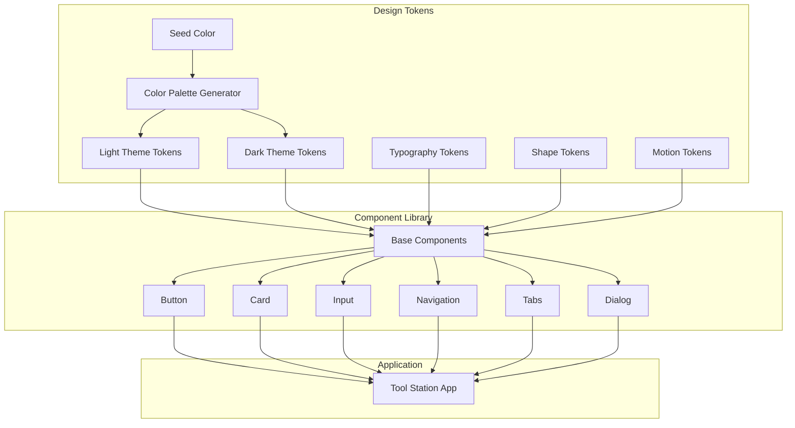

# Design Document: Material You 3 Expressive Redesign

## Overview

本设计文档详细描述了将工具站（Tool Station）从当前的 shadcn/ui + Tailwind CSS 设计系统升级为 Material You 3 Expressive 设计规范的技术方案。

Material You 3 Expressive 是 Google 最新的设计语言变体，相比标准 M3，它具有以下特点：
- 更大的圆角半径（24dp-28dp vs 12dp-16dp）
- 更丰富的动画效果
- 更鲜明的色彩对比
- 更强调个性化和情感表达

本次重新设计将保持现有功能不变，仅更新视觉和交互层面。

## Architecture

### 技术栈

```
┌─────────────────────────────────────────────────────────────┐
│                    Application Layer                         │
│  ┌─────────────────────────────────────────────────────────┐│
│  │                   Next.js 14 App Router                 ││
│  └─────────────────────────────────────────────────────────┘│
├─────────────────────────────────────────────────────────────┤
│                    UI Component Layer                        │
│  ┌─────────────────────────────────────────────────────────┐│
│  │              M3 Expressive Components                   ││
│  │  (Button, Card, Input, Navigation, Tab, Dialog, etc.)   ││
│  └─────────────────────────────────────────────────────────┘│
├─────────────────────────────────────────────────────────────┤
│                    Design Token Layer                        │
│  ┌──────────────┐ ┌──────────────┐ ┌──────────────────────┐ │
│  │    Color     │ │  Typography  │ │   Shape & Motion     │ │
│  │   Tokens     │ │    Tokens    │ │      Tokens          │ │
│  └──────────────┘ └──────────────┘ └──────────────────────┘ │
├─────────────────────────────────────────────────────────────┤
│                    Styling Layer                             │
│  ┌─────────────────────────────────────────────────────────┐│
│  │         Tailwind CSS + CSS Custom Properties            ││
│  └─────────────────────────────────────────────────────────┘│
└─────────────────────────────────────────────────────────────┘
```

### 设计系统架构



## Components and Interfaces

### 1. Design Token System

#### Color Token Interface

```typescript
interface M3ColorScheme {
  // Primary colors
  primary: string;
  onPrimary: string;
  primaryContainer: string;
  onPrimaryContainer: string;
  
  // Secondary colors
  secondary: string;
  onSecondary: string;
  secondaryContainer: string;
  onSecondaryContainer: string;
  
  // Tertiary colors
  tertiary: string;
  onTertiary: string;
  tertiaryContainer: string;
  onTertiaryContainer: string;
  
  // Error colors
  error: string;
  onError: string;
  errorContainer: string;
  onErrorContainer: string;
  
  // Surface colors
  surface: string;
  onSurface: string;
  surfaceVariant: string;
  onSurfaceVariant: string;
  surfaceDim: string;
  surfaceBright: string;
  surfaceContainerLowest: string;
  surfaceContainerLow: string;
  surfaceContainer: string;
  surfaceContainerHigh: string;
  surfaceContainerHighest: string;
  
  // Other colors
  outline: string;
  outlineVariant: string;
  shadow: string;
  scrim: string;
  inverseSurface: string;
  inverseOnSurface: string;
  inversePrimary: string;
}

interface M3StateLayer {
  hover: number;    // 0.08
  focus: number;    // 0.12
  pressed: number;  // 0.12
  dragged: number;  // 0.16
}
```

#### Typography Token Interface

```typescript
interface M3TypeScale {
  displayLarge: TypographyStyle;
  displayMedium: TypographyStyle;
  displaySmall: TypographyStyle;
  headlineLarge: TypographyStyle;
  headlineMedium: TypographyStyle;
  headlineSmall: TypographyStyle;
  titleLarge: TypographyStyle;
  titleMedium: TypographyStyle;
  titleSmall: TypographyStyle;
  bodyLarge: TypographyStyle;
  bodyMedium: TypographyStyle;
  bodySmall: TypographyStyle;
  labelLarge: TypographyStyle;
  labelMedium: TypographyStyle;
  labelSmall: TypographyStyle;
}

interface TypographyStyle {
  fontFamily: string;
  fontSize: string;
  fontWeight: number;
  lineHeight: string;
  letterSpacing: string;
}
```

#### Shape Token Interface (Expressive)

```typescript
interface M3ExpressiveShape {
  extraSmall: string;  // 4px
  small: string;       // 8px
  medium: string;      // 16px
  large: string;       // 24px
  extraLarge: string;  // 28px
  full: string;        // 9999px (pill shape)
}
```

#### Motion Token Interface

```typescript
interface M3Motion {
  duration: {
    short1: string;      // 50ms
    short2: string;      // 100ms
    short3: string;      // 150ms
    short4: string;      // 200ms
    medium1: string;     // 250ms
    medium2: string;     // 300ms
    medium3: string;     // 350ms
    medium4: string;     // 400ms
    long1: string;       // 450ms
    long2: string;       // 500ms
    long3: string;       // 550ms
    long4: string;       // 600ms
    extraLong1: string;  // 700ms
    extraLong2: string;  // 800ms
    extraLong3: string;  // 900ms
    extraLong4: string;  // 1000ms
  };
  easing: {
    standard: string;           // cubic-bezier(0.2, 0, 0, 1)
    standardDecelerate: string; // cubic-bezier(0, 0, 0, 1)
    standardAccelerate: string; // cubic-bezier(0.3, 0, 1, 1)
    emphasized: string;         // cubic-bezier(0.2, 0, 0, 1)
    emphasizedDecelerate: string; // cubic-bezier(0.05, 0.7, 0.1, 1)
    emphasizedAccelerate: string; // cubic-bezier(0.3, 0, 0.8, 0.15)
  };
}
```

### 2. Component Interfaces

#### Button Component

```typescript
interface M3ButtonProps {
  variant: 'filled' | 'outlined' | 'text' | 'elevated' | 'tonal';
  size: 'small' | 'medium' | 'large';
  icon?: React.ReactNode;
  iconPosition?: 'start' | 'end';
  disabled?: boolean;
  loading?: boolean;
  fullWidth?: boolean;
  children: React.ReactNode;
  onClick?: () => void;
}
```

#### Card Component

```typescript
interface M3CardProps {
  variant: 'elevated' | 'filled' | 'outlined';
  interactive?: boolean;
  children: React.ReactNode;
  onClick?: () => void;
}
```

#### Input Component

```typescript
interface M3TextFieldProps {
  variant: 'filled' | 'outlined';
  label: string;
  supportingText?: string;
  errorText?: string;
  leadingIcon?: React.ReactNode;
  trailingIcon?: React.ReactNode;
  disabled?: boolean;
  value: string;
  onChange: (value: string) => void;
}
```

#### Navigation Components

```typescript
interface M3NavigationBarProps {
  items: NavigationItem[];
  activeItem: string;
  onItemClick: (id: string) => void;
}

interface M3NavigationRailProps {
  items: NavigationItem[];
  activeItem: string;
  onItemClick: (id: string) => void;
  fab?: React.ReactNode;
}

interface NavigationItem {
  id: string;
  label: string;
  icon: React.ReactNode;
  activeIcon?: React.ReactNode;
  badge?: number | boolean;
}
```

## Data Models

### Theme Configuration

```typescript
interface ThemeConfig {
  seedColor: string;
  mode: 'light' | 'dark' | 'system';
  colorScheme: M3ColorScheme;
  typography: M3TypeScale;
  shape: M3ExpressiveShape;
  motion: M3Motion;
}
```

### Responsive Breakpoints

```typescript
interface M3Breakpoints {
  compact: number;   // < 600px
  medium: number;    // 600px - 840px
  expanded: number;  // > 840px
}
```


## Correctness Properties

*A property is a characteristic or behavior that should hold true across all valid executions of a system-essentially, a formal statement about what the system should do. Properties serve as the bridge between human-readable specifications and machine-verifiable correctness guarantees.*

Based on the prework analysis, the following correctness properties have been identified:

### Property 1: Color Scheme Generation Completeness

*For any* valid seed color (hex string), the color scheme generator SHALL produce a complete M3ColorScheme object containing all required color tokens (primary, secondary, tertiary, error, and all surface variants) with valid hex color values.

**Validates: Requirements 1.1, 1.2, 1.3**

### Property 2: State Layer Opacity Consistency

*For any* interactive element state (hover, focus, pressed, dragged), the state layer opacity SHALL match the M3 specification values: hover=0.08, focus=0.12, pressed=0.12, dragged=0.16.

**Validates: Requirements 1.4**

### Property 3: Typography Scale Completeness

*For any* M3 type scale configuration, all 15 typography styles (display-large through label-small) SHALL be defined with valid fontFamily, fontSize, fontWeight, lineHeight, and letterSpacing values.

**Validates: Requirements 2.1**

### Property 4: Color Contrast Compliance

*For any* text color and background color combination used in the application, the contrast ratio SHALL be at least 4.5:1 for body text and 3:1 for large text (18px+ or 14px+ bold) to meet WCAG 2.1 AA standards.

**Validates: Requirements 2.3, 11.2**

### Property 5: Shape Token Validity

*For any* M3 Expressive shape token (extraSmall, small, medium, large, extraLarge, full), the value SHALL be a valid CSS border-radius value with extraSmall=4px, small=8px, medium=16px, large=24px, extraLarge=28px, full=9999px.

**Validates: Requirements 3.1, 3.2, 3.3**

### Property 6: Motion Token Validity

*For any* M3 motion duration token, the value SHALL be within the range of 50ms to 1000ms. *For any* M3 easing token, the value SHALL be a valid CSS cubic-bezier function.

**Validates: Requirements 5.1, 5.2**

### Property 7: Responsive Layout Breakpoint Consistency

*For any* viewport width, the layout mode SHALL be: compact when width < 600px, medium when 600px ≤ width < 840px, expanded when width ≥ 840px.

**Validates: Requirements 6.1, 6.2, 6.3**

### Property 8: Touch Target Minimum Size

*For any* interactive element on mobile, the touch target size SHALL be at least 48dp × 48dp.

**Validates: Requirements 12.1, 13.3**

### Property 9: Dark Mode Color Scheme Validity

*For any* dark mode color scheme, all surface colors SHALL use tonal elevation (lighter surface colors for higher elevation) instead of shadow elevation.

**Validates: Requirements 11.1**

### Property 10: Mobile Layout Vertical Stacking

*For any* tool page displayed on a compact viewport (width < 600px), input and output sections SHALL be arranged in a vertical stack (not side-by-side).

**Validates: Requirements 15.1, 15.2**

## Error Handling

### Color Generation Errors

```typescript
class ColorGenerationError extends Error {
  constructor(
    public seedColor: string,
    public reason: string
  ) {
    super(`Failed to generate color scheme from seed "${seedColor}": ${reason}`);
  }
}
```

Error scenarios:
- Invalid seed color format (not a valid hex color)
- Color generation algorithm failure

Recovery strategy:
- Fall back to default seed color (#6750A4 - M3 default purple)
- Log error for debugging

### Theme Application Errors

```typescript
class ThemeApplicationError extends Error {
  constructor(
    public theme: 'light' | 'dark',
    public reason: string
  ) {
    super(`Failed to apply ${theme} theme: ${reason}`);
  }
}
```

Error scenarios:
- CSS custom properties not supported
- Theme configuration invalid

Recovery strategy:
- Fall back to light theme
- Apply inline styles as fallback

### Component Rendering Errors

Error scenarios:
- Missing required props
- Invalid variant specified
- Animation API not supported

Recovery strategy:
- Use default prop values
- Disable animations gracefully
- Render fallback UI

## Testing Strategy

### Dual Testing Approach

This project uses both unit testing and property-based testing to ensure comprehensive coverage:

1. **Unit Tests**: Verify specific examples, edge cases, and error conditions
2. **Property-Based Tests**: Verify universal properties that should hold across all inputs

### Property-Based Testing Framework

**Framework**: fast-check (TypeScript property-based testing library)

**Configuration**:
```typescript
import fc from 'fast-check';

// Configure minimum 100 iterations per property test
fc.configureGlobal({ numRuns: 100 });
```

### Test Categories

#### 1. Color System Tests

**Property Tests**:
- Color scheme generation completeness (Property 1)
- State layer opacity values (Property 2)
- Contrast ratio compliance (Property 4)
- Dark mode color validity (Property 9)

**Unit Tests**:
- Specific seed color to scheme mapping
- Edge cases: black, white, grayscale seeds
- Invalid color format handling

#### 2. Typography System Tests

**Property Tests**:
- Typography scale completeness (Property 3)

**Unit Tests**:
- Font loading verification
- Specific style application

#### 3. Shape System Tests

**Property Tests**:
- Shape token validity (Property 5)

**Unit Tests**:
- Component-specific shape application
- Expressive vs standard shape comparison

#### 4. Motion System Tests

**Property Tests**:
- Motion token validity (Property 6)

**Unit Tests**:
- Animation timing verification
- Reduced motion preference handling

#### 5. Layout System Tests

**Property Tests**:
- Responsive breakpoint consistency (Property 7)
- Mobile vertical stacking (Property 10)

**Unit Tests**:
- Specific breakpoint transitions
- Navigation component switching

#### 6. Accessibility Tests

**Property Tests**:
- Touch target minimum size (Property 8)

**Unit Tests**:
- ARIA label presence
- Focus indicator visibility
- Keyboard navigation

### Test File Structure

```
__tests__/
├── design-tokens/
│   ├── color.test.ts
│   ├── color.property.test.ts
│   ├── typography.test.ts
│   ├── typography.property.test.ts
│   ├── shape.test.ts
│   ├── shape.property.test.ts
│   ├── motion.test.ts
│   └── motion.property.test.ts
├── components/
│   ├── button.test.tsx
│   ├── card.test.tsx
│   ├── input.test.tsx
│   ├── navigation.test.tsx
│   └── tabs.test.tsx
├── layout/
│   ├── responsive.test.ts
│   ├── responsive.property.test.ts
│   └── mobile.property.test.ts
└── accessibility/
    ├── touch-targets.property.test.ts
    └── contrast.property.test.ts
```

### Property Test Annotation Format

Each property-based test MUST be annotated with:
```typescript
/**
 * **Feature: material-you-3-expressive-redesign, Property 1: Color Scheme Generation Completeness**
 * **Validates: Requirements 1.1, 1.2, 1.3**
 */
```

## Implementation Details

### CSS Custom Properties Structure

```css
:root {
  /* Primary */
  --md-sys-color-primary: #6750A4;
  --md-sys-color-on-primary: #FFFFFF;
  --md-sys-color-primary-container: #EADDFF;
  --md-sys-color-on-primary-container: #21005D;
  
  /* Secondary */
  --md-sys-color-secondary: #625B71;
  --md-sys-color-on-secondary: #FFFFFF;
  --md-sys-color-secondary-container: #E8DEF8;
  --md-sys-color-on-secondary-container: #1D192B;
  
  /* Tertiary */
  --md-sys-color-tertiary: #7D5260;
  --md-sys-color-on-tertiary: #FFFFFF;
  --md-sys-color-tertiary-container: #FFD8E4;
  --md-sys-color-on-tertiary-container: #31111D;
  
  /* Error */
  --md-sys-color-error: #B3261E;
  --md-sys-color-on-error: #FFFFFF;
  --md-sys-color-error-container: #F9DEDC;
  --md-sys-color-on-error-container: #410E0B;
  
  /* Surface */
  --md-sys-color-surface: #FEF7FF;
  --md-sys-color-on-surface: #1D1B20;
  --md-sys-color-surface-variant: #E7E0EC;
  --md-sys-color-on-surface-variant: #49454F;
  --md-sys-color-surface-dim: #DED8E1;
  --md-sys-color-surface-bright: #FEF7FF;
  --md-sys-color-surface-container-lowest: #FFFFFF;
  --md-sys-color-surface-container-low: #F7F2FA;
  --md-sys-color-surface-container: #F3EDF7;
  --md-sys-color-surface-container-high: #ECE6F0;
  --md-sys-color-surface-container-highest: #E6E0E9;
  
  /* Outline */
  --md-sys-color-outline: #79747E;
  --md-sys-color-outline-variant: #CAC4D0;
  
  /* Other */
  --md-sys-color-shadow: #000000;
  --md-sys-color-scrim: #000000;
  --md-sys-color-inverse-surface: #322F35;
  --md-sys-color-inverse-on-surface: #F5EFF7;
  --md-sys-color-inverse-primary: #D0BCFF;
  
  /* State layers */
  --md-sys-state-hover-opacity: 0.08;
  --md-sys-state-focus-opacity: 0.12;
  --md-sys-state-pressed-opacity: 0.12;
  --md-sys-state-dragged-opacity: 0.16;
  
  /* Shape (Expressive) */
  --md-sys-shape-corner-extra-small: 4px;
  --md-sys-shape-corner-small: 8px;
  --md-sys-shape-corner-medium: 16px;
  --md-sys-shape-corner-large: 24px;
  --md-sys-shape-corner-extra-large: 28px;
  --md-sys-shape-corner-full: 9999px;
  
  /* Motion */
  --md-sys-motion-duration-short1: 50ms;
  --md-sys-motion-duration-short2: 100ms;
  --md-sys-motion-duration-short3: 150ms;
  --md-sys-motion-duration-short4: 200ms;
  --md-sys-motion-duration-medium1: 250ms;
  --md-sys-motion-duration-medium2: 300ms;
  --md-sys-motion-duration-medium3: 350ms;
  --md-sys-motion-duration-medium4: 400ms;
  --md-sys-motion-duration-long1: 450ms;
  --md-sys-motion-duration-long2: 500ms;
  
  --md-sys-motion-easing-standard: cubic-bezier(0.2, 0, 0, 1);
  --md-sys-motion-easing-standard-decelerate: cubic-bezier(0, 0, 0, 1);
  --md-sys-motion-easing-standard-accelerate: cubic-bezier(0.3, 0, 1, 1);
  --md-sys-motion-easing-emphasized: cubic-bezier(0.2, 0, 0, 1);
  --md-sys-motion-easing-emphasized-decelerate: cubic-bezier(0.05, 0.7, 0.1, 1);
  --md-sys-motion-easing-emphasized-accelerate: cubic-bezier(0.3, 0, 0.8, 0.15);
  
  /* Typography */
  --md-sys-typescale-display-large-font: 'Google Sans', 'Roboto', sans-serif;
  --md-sys-typescale-display-large-size: 57px;
  --md-sys-typescale-display-large-weight: 400;
  --md-sys-typescale-display-large-line-height: 64px;
  --md-sys-typescale-display-large-tracking: -0.25px;
  
  /* ... additional typography tokens ... */
}

.dark {
  --md-sys-color-primary: #D0BCFF;
  --md-sys-color-on-primary: #381E72;
  --md-sys-color-primary-container: #4F378B;
  --md-sys-color-on-primary-container: #EADDFF;
  
  --md-sys-color-surface: #141218;
  --md-sys-color-on-surface: #E6E0E9;
  --md-sys-color-surface-dim: #141218;
  --md-sys-color-surface-bright: #3B383E;
  --md-sys-color-surface-container-lowest: #0F0D13;
  --md-sys-color-surface-container-low: #1D1B20;
  --md-sys-color-surface-container: #211F26;
  --md-sys-color-surface-container-high: #2B2930;
  --md-sys-color-surface-container-highest: #36343B;
  
  /* ... additional dark mode tokens ... */
}
```

### Tailwind CSS Integration

```typescript
// tailwind.config.ts
const config = {
  theme: {
    extend: {
      colors: {
        primary: 'var(--md-sys-color-primary)',
        'on-primary': 'var(--md-sys-color-on-primary)',
        'primary-container': 'var(--md-sys-color-primary-container)',
        'on-primary-container': 'var(--md-sys-color-on-primary-container)',
        // ... all M3 color tokens
      },
      borderRadius: {
        'xs': 'var(--md-sys-shape-corner-extra-small)',
        'sm': 'var(--md-sys-shape-corner-small)',
        'md': 'var(--md-sys-shape-corner-medium)',
        'lg': 'var(--md-sys-shape-corner-large)',
        'xl': 'var(--md-sys-shape-corner-extra-large)',
        'full': 'var(--md-sys-shape-corner-full)',
      },
      transitionDuration: {
        'short-1': 'var(--md-sys-motion-duration-short1)',
        'short-2': 'var(--md-sys-motion-duration-short2)',
        'medium-2': 'var(--md-sys-motion-duration-medium2)',
        'long-2': 'var(--md-sys-motion-duration-long2)',
      },
      transitionTimingFunction: {
        'standard': 'var(--md-sys-motion-easing-standard)',
        'emphasized': 'var(--md-sys-motion-easing-emphasized)',
        'emphasized-decelerate': 'var(--md-sys-motion-easing-emphasized-decelerate)',
      },
    },
  },
};
```

### File Structure

```
lib/
├── m3/
│   ├── tokens/
│   │   ├── color.ts          # Color token definitions and generator
│   │   ├── typography.ts     # Typography scale definitions
│   │   ├── shape.ts          # Shape token definitions
│   │   └── motion.ts         # Motion token definitions
│   ├── theme/
│   │   ├── provider.tsx      # M3 Theme Provider component
│   │   ├── context.ts        # Theme context
│   │   └── utils.ts          # Theme utilities
│   └── index.ts              # Public API exports

components/
├── m3/
│   ├── button/
│   │   ├── button.tsx
│   │   ├── button.styles.ts
│   │   └── index.ts
│   ├── card/
│   │   ├── card.tsx
│   │   ├── card.styles.ts
│   │   └── index.ts
│   ├── input/
│   │   ├── text-field.tsx
│   │   ├── text-field.styles.ts
│   │   └── index.ts
│   ├── navigation/
│   │   ├── navigation-bar.tsx
│   │   ├── navigation-rail.tsx
│   │   └── index.ts
│   ├── tabs/
│   │   ├── tabs.tsx
│   │   ├── tab.tsx
│   │   └── index.ts
│   └── index.ts              # Component exports

app/
├── globals.css               # M3 CSS custom properties
└── ...
```
