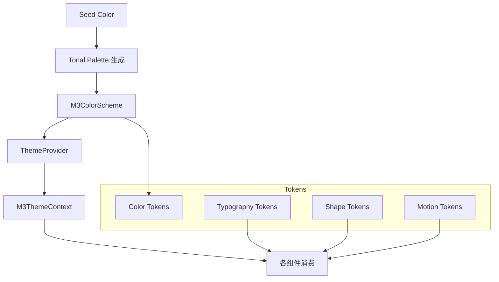

# M3 Expressive 设计系统

## 概述

项目实现了手搓版 **Material You 3 Expressive** 设计系统，无需任何外部 UI 库（如 MUI）。设计语言以 **Matcha（抹茶绿）** 为种子色，构建完整的语义化主题系统。

## 架构



## 目录结构

```
lib/m3/
├── theme/
│   ├── context.ts      # M3ThemeContext + useM3Theme/useM3ColorScheme hooks
│   ├── provider.tsx    # M3ThemeProvider (next-themes + M3 动态颜色生成)
│   └── index.ts
├── tokens/
│   ├── color.ts        # M3ColorScheme, tonal palette 生成, WCAG 对比度
│   ├── typography.ts   # 15-style M3 type scale, WCAG 对比度工具
│   ├── shape.ts        # 圆角 Token + 组件形状推荐
│   ├── motion.ts       # 时长/缓动 Token + 过渡预设 + reduced motion
│   └── *.test.ts       # 属性测试 (fast-check)
└── performance/
    ├── animation-utils.ts  # GPU 加速动画辅助
    ├── lazy-icon.tsx       # 惰性加载图标
    ├── lazy-image.tsx      # 惰性加载图片
    └── index.ts
```

## Token 系统

### 颜色
- 基于种子色生成 6 阶主色 + 中性色 tonal palette
- 包含状态层 (state layers): hover/focus/pressed/dragged
- 内置 WCAG AA/AAA 对比度校验

### 字体
- 15-style type scale: display/small...body/medium...label/small
- 使用 CSS 变量注入，支持运行时切换

### 形状
- Expressive 风格圆角: xs/sm/md/lg/xl/full
- 每个圆角值对应不同的组件推荐

### 动效
- 16 种持续时间 Token
- 6 种缓动曲线 (emphasized/standard/accelerate/decelerate 等)
- 过渡预设 (Transitions Presets)

## 组件体系

共有两套组件库，共存互补：

| 组件库 | 数量 | 基础 | 用途 |
|--------|------|------|------|
| `components/ui/` | 52 文件 | Radix UI 原语 | 通用 UI 控件 (源自 shadcn/ui) |
| `components/m3/` | 53 文件 | 手搓 M3 样式 | Material You 3 风格组件 |

## 相关文档

- [[02-frontend-architecture]]
- [[07-performance]]
