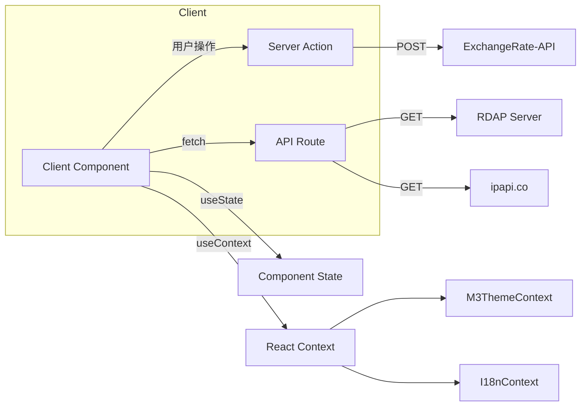

# 前端架构

## 技术栈

| 层面 | 选型 |
|------|------|
| 框架 | Next.js 15 (App Router, React 18) |
| 语言 | TypeScript 5 (strict mode) |
| 样式 | Tailwind CSS 3 + CSS 自定义变量 |
| 设计系统 | M3 Expressive (手搓) |
| 包管理 | pnpm |

## 目录结构

```
app/                          # Next.js App Router
├── globals.css               # ~1380 行 M3 CSS Token 系统
├── layout.tsx                # 根布局: M3Theme + I18n + BottomNav
├── page.tsx                  # 首页 Hero
├── api/                      # API Routes
│   ├── whois/route.ts        # RDAP WHOIS
│   ├── hash/route.ts         # 服务端 Hash 计算
│   └── ip-info/route.ts      # IP 地理定位
└── tools/                    # 工具页面 (核心)
    ├── layout.tsx            # + Header 包装
    ├── page.tsx              # ~1300 行主页面 (标签页系统)
    ├── search-utils.ts       # ~1224 行搜索索引
    ├── [tool]/               # 重定向到 ?tool=xxx
    ├── hash/...              # 各工具子页面
    └── ... (35+ 工具目录)

components/                   # 共享组件
├── ui/                       # shadcn/ui 原语 (52 文件)
├── m3/                       # M3 风格组件 (53 文件)
├── header.tsx                # 顶栏
├── bottom-nav.tsx            # 底部导航 (移动端)
├── i18n-provider.tsx         # 国际化上下文
├── tool-grid.tsx             # 工具卡片网格
├── tool-search.tsx           # 工具搜索
└── json-tree-view.tsx        # JSON 树查看

hooks/                        # 自定义 Hooks (11 文件)
lib/                          # 核心库
├── m3/                       # 设计系统
├── utils.ts                  # cn() 工具
├── translations.ts           # 中英文翻译
└── domain-extractor.ts       # 域名提取
```

## 数据流



## 状态管理

- **无全局状态库**（无 Redux/Zustand/Jotai）
- **React Context** 用于横切关注点：主题、国际化
- **组件局部状态** 用于各工具内部数据
- **URL search params** 用于标签页状态序列化
- **localStorage** 用于标签页持久化和语言偏好

## 相关文档

- [[01-design-system]]
- [[03-tool-system]]
- [[04-i18n]]
