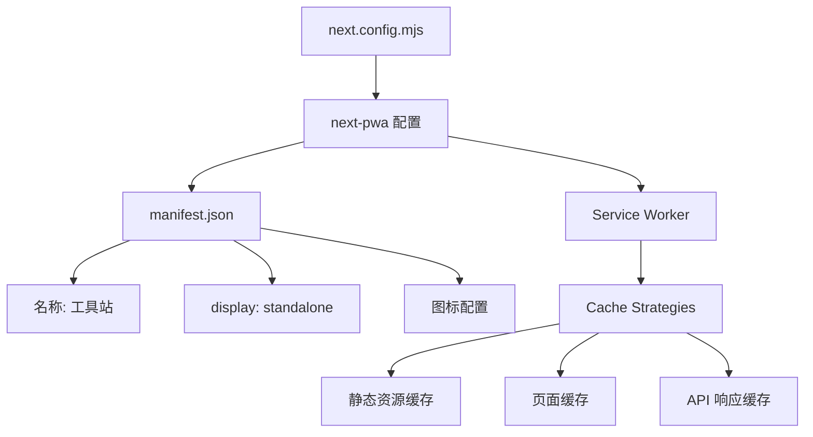

# PWA 与离线支持

## 概述

网站通过 `next-pwa` 实现 Progressive Web App 支持，结合所有工具纯客户端运行的特点，可实现完全离线使用。

## 配置

## 关键配置 (next.config.mjs)

- `next-pwa` 已启用
- `public/manifest.json` 定义了 PWA manifest
- 中文应用名称、standalone 展示模式
- 完整的图标集

## 离线能力分析

| 功能 | 离线支持 | 说明 |
|------|----------|------|
| 全部加解密工具 | ✅ 完整 | 纯浏览器端计算 |
| 编码解码 | ✅ 完整 | 无外部依赖 |
| 图片处理 | ✅ 完整 | Canvas API 本地处理 |
| JSON/Protobuf 解析 | ✅ 完整 | 纯文本处理 |
| 时间工具 | ✅ 完整 | 使用系统时间 |
| QR 码生成 | ✅ 完整 | 客户端渲染 |
| 设备信息 | ✅ 完整 | 读取 navigator API |
| WHOIS 查询 | ❌ 需网络 | API 路由 |
| 汇率转换 | ❌ 需网络 | 外部 API |
| IP 信息 | ❌ 需网络 | 外部 API |

## 相关文档

- [[02-frontend-architecture]]
- [[07-performance]]
