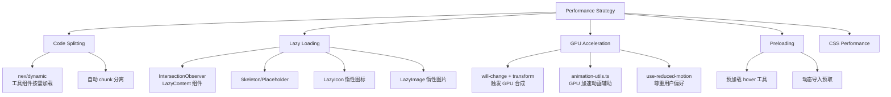

# 性能优化

## 优化全景

## 关键优化点

### 1. 代码分割 (Code Splitting)
- 35+ 工具各自通过 `next/dynamic` 独立打包
- 每个工具 `page.tsx` 为单独的 chunk
- 首屏不加载任何工具代码

### 2. 懒加载 (Lazy Loading)
- `LazyContent` 组件：使用 IntersectionObserver 监测视口
- `LazyIcon`：动态 `import()` lucide-react 图标
- `LazyImage`：图片懒加载 + skeleton 占位

### 3. GPU 加速动画
- 使用 `transform` + `opacity` 进行动画（触发 GPU 合成）
- `animation-utils.ts` 提供 GPU 加速辅助函数
- 通过 `use-reduced-motion` hook 尊重用户无障碍偏好

### 4. CSS 性能
- Tailwind JIT 模式（仅生成用到的样式）
- 1380 行 `globals.css` 使用 CSS 变量而非 JS 运行时
- `cva` (class-variance-authority) 管理组件变体

### 5. 搜索性能
- `search-utils.ts` 构建预计算索引
- 搜索在 ~400ms 内完成

## 相关文档

- [[01-design-system]]
- [[03-tool-system]]
