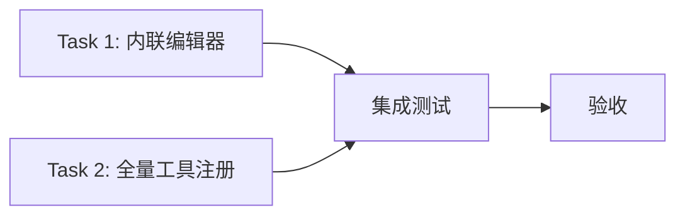

# 低代码画布 V2 实现计划

## 1. 需求变更概述

### 变更来源

PR #1 review 意见：https://github.com/Deliay/tool-website/pull/1

### 变更对比

| 变更项 | V1（已实现） | V2（待实现） |
|--------|-------------|-------------|
| 基础节点编辑 | 仅展示值，编辑在右侧面板 | **节点内嵌编辑框**，可直接编辑 |
| input 连接后 | 无特殊处理 | **禁用编辑框**，只读展示上游值 |
| JSON 节点 | 单行输入 | **多行文本编辑器** |
| File 节点 | 仅上传 | **上传 + 下载按钮** |
| 工具注册 | 5 个工具 | **全部 34 个工具** |

---

## 2. 新增文件清单

### 2.1 内联编辑器组件

| 文件 | 职责 | 状态 |
|------|------|------|
| `components/canvas/nodes/InlineEditor.tsx` | 内联编辑器容器，根据节点类型分发 | 新增 |
| `components/canvas/nodes/editors/StringEditor.tsx` | String 单行输入框，支持 disabled | 新增 |
| `components/canvas/nodes/editors/NumberEditor.tsx` | Number 数字输入框，支持 disabled | 新增 |
| `components/canvas/nodes/editors/JsonEditor.tsx` | JSON 多行 textarea，支持 disabled | 新增 |
| `components/canvas/nodes/editors/FileEditor.tsx` | File 上传区域 + 下载按钮，支持 disabled | 新增 |

### 2.2 需修改文件

| 文件 | 修改内容 |
|------|----------|
| `components/canvas/nodes/BaseNode.tsx` | 集成 InlineEditor，检测 input 连接状态 |
| `lib/adapters/basic.ts` | 为每个基础节点添加 input 端口 |
| `lib/adapters/index.ts` | 注册所有 34 个工具适配器 |

### 2.3 新增工具适配器

| 文件 | 工具 | 分类 |
|------|------|------|
| `lib/adapters/hmac.ts` | HMAC | crypto |
| `lib/adapters/crypto.ts` | Crypto | crypto |
| `lib/adapters/classic-cipher.ts` | Classic Cipher | crypto |
| `lib/adapters/jwt.ts` | JWT | crypto |
| `lib/adapters/json-format.ts` | JSON Format | data |
| `lib/adapters/protobuf.ts` | Protobuf | data |
| `lib/adapters/jce.ts` | JCE | data |
| `lib/adapters/image-to-base64.ts` | Image to Base64 | image |
| `lib/adapters/exif-viewer.ts` | EXIF Viewer | image |
| `lib/adapters/image-compress.ts` | Image Compress | image |
| `lib/adapters/image-editor.ts` | Image Editor | image |
| `lib/adapters/qrcode.ts` | QRCode Generate | image |
| `lib/adapters/qrcode-decode.ts` | QRCode Decode | image |
| `lib/adapters/meme-splitter.ts` | Meme Splitter | image |
| `lib/adapters/image-coordinates.ts` | Image Coordinates | image |
| `lib/adapters/text-stats.ts` | Text Stats | text |
| `lib/adapters/case-converter.ts` | Case Converter | text |
| `lib/adapters/regex.ts` | Regex | text |
| `lib/adapters/diff.ts` | Diff | text |
| `lib/adapters/http-tester.ts` | HTTP Tester | dev |
| `lib/adapters/crontab.ts` | Crontab | dev |
| `lib/adapters/docker-converter.ts` | Docker Converter | dev |
| `lib/adapters/whois.ts` | Whois | dev |
| `lib/adapters/totp.ts` | TOTP | utility |
| `lib/adapters/color.ts` | Color | utility |
| `lib/adapters/currency.ts` | Currency | utility |
| `lib/adapters/bmi.ts` | BMI | utility |
| `lib/adapters/device-info.ts` | Device Info | viewer |
| `lib/adapters/office-viewer.ts` | Office Viewer | viewer |
| `lib/adapters/time.ts` | Time | viewer |

---

## 3. 开发任务

### Task 1: 基础节点内联编辑器

**目标**: String/Number/JSON/File 节点支持在节点上直接编辑

**子任务**:
1. 修改 `lib/adapters/basic.ts`
   - 为 String/Number/JSON 节点添加 `input` 端口
   - File 节点添加 `input: bytes` 端口
   
2. 创建 `components/canvas/nodes/editors/StringEditor.tsx`
   ```tsx
   interface Props {
     value: string
     disabled: boolean  // input 连接时为 true
     onChange: (value: string) => void
   }
   ```
   - 单行 `<input type="text">`
   - disabled 时显示灰色，不可编辑

3. 创建 `components/canvas/nodes/editors/NumberEditor.tsx`
   ```tsx
   interface Props {
     value: number
     disabled: boolean
     onChange: (value: number) => void
   }
   ```
   - `<input type="number">`
   - disabled 时显示灰色，不可编辑

4. 创建 `components/canvas/nodes/editors/JsonEditor.tsx`
   ```tsx
   interface Props {
     value: string
     disabled: boolean
     onChange: (value: string) => void
   }
   ```
   - **多行 `<textarea>`**，4 行高度
   - 等宽字体
   - disabled 时显示灰色，不可编辑

5. 创建 `components/canvas/nodes/editors/FileEditor.tsx`
   ```tsx
   interface Props {
     disabled: boolean  // input 连接时为 true
     file: File | null
     onFileChange: (file: File | null) => void
   }
   ```
   - 未连接：显示文件上传区域（拖拽/点击）
   - 已连接：禁用上传，显示文件名和大小
   - **下载按钮**：始终可用

6. 创建 `components/canvas/nodes/InlineEditor.tsx`
   - 容器组件，根据 `definition.type` 分发到对应编辑器
   - 从 Zustand store 获取 `isInputConnected` 状态

7. 修改 `components/canvas/nodes/BaseNode.tsx`
   - 在端口区域下方添加 `<InlineEditor />`
   - 传递 `nodeId` 和 `definition`

### Task 2: 全量工具注册

**目标**: 所有 34 个工具出现在节点面板中

**子任务**:
1. 创建 29 个工具适配器（见 2.3 节清单）
2. 每个适配器实现 `ToolAdapter` 接口
3. 更新 `lib/adapters/index.ts`，调用所有注册函数
4. 验证 NodePalette 中显示所有工具

### Task 3: 测试

**子任务**:
1. 内联编辑器组件测试
   - StringEditor 渲染和交互
   - NumberEditor 渲染和交互
   - JsonEditor 渲染和交互
   - FileEditor 渲染和交互
   - disabled 状态测试

2. E2E 测试更新
   - 测试节点内编辑框显示
   - 测试 input 连接后编辑框禁用
   - 测试 File 节点下载按钮

---

## 4. 验收标准

### 内联编辑验收

- [ ] String 节点：节点内显示单行输入框，可直接编辑
- [ ] Number 节点：节点内显示数字输入框，可直接编辑
- [ ] JSON 节点：节点内显示多行 textarea，可直接编辑
- [ ] File 节点：未连接时显示上传区域，已连接时禁用上传
- [ ] File 节点：下载按钮始终可用
- [ ] input 连接后：编辑框自动禁用，只读展示上游值
- [ ] input 断开后：编辑框恢复可编辑状态

### 工具注册验收

- [ ] 所有 34 个工具已注册到节点面板
- [ ] 节点面板按分类显示：basic, crypto, data, image, text, dev, utility, viewer
- [ ] 每个工具可拖拽到画布

### 测试验收

- [ ] 内联编辑器组件测试通过
- [ ] E2E 测试通过
- [ ] 无 TypeScript 类型错误

---

## 5. 实施顺序



**建议顺序**:
1. 先完成 Task 1（内联编辑器）- 核心交互变更
2. 再完成 Task 2（全量工具注册）- 功能完整性
3. 最后 Task 3（测试）- 质量保证
