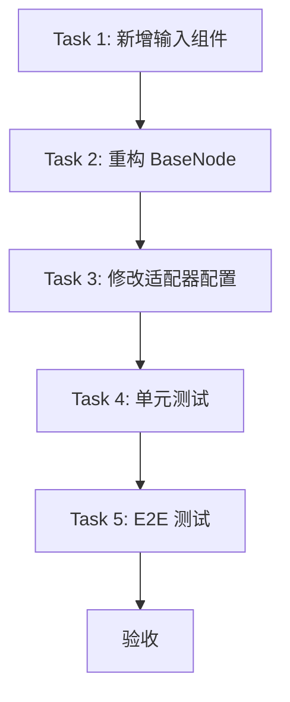

# 低代码画布 V3 实现计划

## 1. 任务总览

| Task | 内容 | 文件数 |
|------|------|--------|
| Task 1 | 新增输入组件 | 6 |
| Task 2 | 重构 BaseNode | 1 |
| Task 3 | 修改全部适配器配置 | 20 |
| Task 4 | 单元测试 | 8 |
| Task 5 | E2E 测试更新 | 1 |

---

## 2. Task 1: 新增输入组件

### 2.1 新增文件

| 文件 | 职责 |
|------|------|
| `components/canvas/nodes/ConfigInput.tsx` | 配置输入分发组件 |
| `components/canvas/nodes/SelectInput.tsx` | 下拉单选 |
| `components/canvas/nodes/SliderInput.tsx` | 滑块 |
| `components/canvas/nodes/SwitchInput.tsx` | 开关 |
| `components/canvas/nodes/ColorInput.tsx` | 颜色选择器 |
| `components/canvas/nodes/ParameterRow.tsx` | 参数行容器 |

### 2.2 删除文件

| 文件 | 原因 |
|------|------|
| `components/canvas/nodes/InlineEditor.tsx` | 被 ParameterRow 替代 |
| `components/canvas/nodes/editors/StringEditor.tsx` | 被 ConfigInput 替代 |
| `components/canvas/nodes/editors/NumberEditor.tsx` | 被 ConfigInput 替代 |
| `components/canvas/nodes/editors/JsonEditor.tsx` | 被 ConfigInput 替代 |
| `components/canvas/nodes/editors/FileEditor.tsx` | 被 ConfigInput 替代 |
| `components/canvas/nodes/editors/*.test.tsx` | 对应组件删除 |

---

## 3. Task 2: 重构 BaseNode

### 3.1 修改文件

| 文件 | 修改内容 |
|------|----------|
| `components/canvas/nodes/BaseNode.tsx` | 使用 ParameterRow 替代 InlineEditor |

### 3.2 新布局结构

```
Header (icon + label)
├── 输入端口行 (port + 关联参数)
│   ├── ● input    [输入值/控件]
│   ├── ● data     [输入值/控件]
│   └── ● key      [输入值/控件]
├── 独立参数行
│   ├── [▼ Algorithm]
│   ├── [●━━━━━━━━●━━━]
│   └── [☐ Switch]
└── 输出端口行
    ├── [输出值]  ● output
    └── [输出值]  ● result
```

---

## 4. Task 3: 修改全部适配器配置

### 4.1 basic (4 个)

#### string
```typescript
// lib/adapters/basic.ts
config: [
  { id: "value", name: "Value", dataType: "string", defaultValue: "", portId: "input" },
]
```
- 无变更

#### number
```typescript
config: [
  { id: "value", name: "Value", dataType: "number", defaultValue: 0, portId: "input" },
]
```
- 无变更

#### json
```typescript
config: [
  { id: "value", name: "Value", dataType: "string", defaultValue: "{}", multiline: true, portId: "input" },
]
```
- **修改**: 添加 `multiline: true`

#### file
```typescript
config: [
  { id: "file", name: "File", dataType: "bytes", portId: "input" },
]
```
- 无变更

---

### 4.2 crypto (6 个)

#### hash
```typescript
// lib/adapters/hash.ts
config: [
  {
    id: "algorithm",
    name: "Algorithm",
    dataType: "string",
    defaultValue: "sha256",
    options: [
      { label: "MD5", value: "md5" },
      { label: "SHA-1", value: "sha1" },
      { label: "SHA-256", value: "sha256" },
      { label: "SHA-384", value: "sha384" },
      { label: "SHA-512", value: "sha512" },
      { label: "SHA3", value: "sha3" },
      { label: "RIPEMD-160", value: "ripemd160" },
    ],
  },
  {
    id: "variant",
    name: "Variant",
    dataType: "string",
    defaultValue: "sha3-256",
    dependsOn: "algorithm",
    dynamicOptions: (algorithm) => {
      if (algorithm === "sha3") {
        return [
          { label: "SHA3-256", value: "sha3-256" },
          { label: "SHA3-384", value: "sha3-384" },
          { label: "SHA3-512", value: "sha3-512" },
          { label: "SHAKE128", value: "shake128" },
          { label: "SHAKE256", value: "shake256" },
        ]
      }
      return []
    },
  },
  {
    id: "outputFormat",
    name: "Output",
    dataType: "string",
    defaultValue: "hex",
    options: [
      { label: "Hex", value: "hex" },
      { label: "Base64", value: "base64" },
    ],
  },
]
```
**修改**: 添加 variant (联动), outputFormat, 扩展 algorithm 选项

#### hmac
```typescript
// lib/adapters/hmac.ts
config: [
  {
    id: "algorithm",
    name: "Algorithm",
    dataType: "string",
    defaultValue: "sha256",
    options: [
      { label: "MD5", value: "md5" },
      { label: "SHA-1", value: "sha1" },
      { label: "SHA-224", value: "sha224" },
      { label: "SHA-256", value: "sha256" },
      { label: "SHA-384", value: "sha384" },
      { label: "SHA-512", value: "sha512" },
      { label: "SHA3-256", value: "sha3-256" },
      { label: "SHA3-512", value: "sha3-512" },
      { label: "RIPEMD-160", value: "ripemd160" },
    ],
  },
  {
    id: "keyFormat",
    name: "Key Format",
    dataType: "string",
    defaultValue: "raw",
    options: [
      { label: "Raw", value: "raw" },
      { label: "Hex", value: "hex" },
      { label: "Base64", value: "base64" },
    ],
  },
  {
    id: "outputFormat",
    name: "Output",
    dataType: "string",
    defaultValue: "hex",
    options: [
      { label: "Hex", value: "hex" },
      { label: "Base64", value: "base64" },
    ],
  },
]
```
**修改**: 添加 keyFormat, outputFormat, 扩展 algorithm 选项

#### crypto
```typescript
// lib/adapters/crypto.ts
config: [
  {
    id: "algorithm",
    name: "Algorithm",
    dataType: "string",
    defaultValue: "aes",
    options: [
      { label: "AES", value: "aes" },
      { label: "DES", value: "des" },
      { label: "TripleDES", value: "tripledes" },
      { label: "Blowfish", value: "blowfish" },
      { label: "RC4", value: "rc4" },
      { label: "Rabbit", value: "rabbit" },
    ],
  },
  {
    id: "mode",
    name: "Mode",
    dataType: "string",
    defaultValue: "CBC",
    dependsOn: "algorithm",
    dynamicOptions: (algorithm) => {
      if (["rc4", "rabbit"].includes(algorithm)) return [{ label: "Stream", value: "stream" }]
      return [
        { label: "CBC", value: "CBC" },
        { label: "ECB", value: "ECB" },
        { label: "CFB", value: "CFB" },
        { label: "OFB", value: "OFB" },
        { label: "CTR", value: "CTR" },
      ]
    },
  },
  {
    id: "keySize",
    name: "Key Size",
    dataType: "string",
    defaultValue: "256",
    dependsOn: "algorithm",
    dynamicOptions: (algorithm) => {
      const sizes: Record<string, Array<{ label: string; value: string }>> = {
        aes: [{ label: "128", value: "128" }, { label: "192", value: "192" }, { label: "256", value: "256" }],
        des: [{ label: "64", value: "64" }],
        tripledes: [{ label: "192", value: "192" }],
        blowfish: [{ label: "32-448", value: "448" }],
        rc4: [{ label: "Variable", value: "variable" }],
        rabbit: [{ label: "128", value: "128" }],
      }
      return sizes[algorithm] ?? []
    },
  },
  {
    id: "keyFormat",
    name: "Key Format",
    dataType: "string",
    defaultValue: "hex",
    options: [
      { label: "Hex", value: "hex" },
      { label: "Base64", value: "base64" },
      { label: "Raw", value: "raw" },
    ],
  },
  {
    id: "operation",
    name: "Operation",
    dataType: "string",
    defaultValue: "encrypt",
    options: [
      { label: "Encrypt", value: "encrypt" },
      { label: "Decrypt", value: "decrypt" },
    ],
  },
]
```
**修改**: 重构整个 config，添加联动

#### encoding
```typescript
// lib/adapters/encoding.ts
config: [
  {
    id: "encoding",
    name: "Encoding",
    dataType: "string",
    defaultValue: "base64",
    options: [
      { label: "Base64", value: "base64" },
      { label: "URL", value: "url" },
      { label: "HEX", value: "hex" },
      { label: "HTML", value: "html" },
      { label: "Unicode", value: "unicode" },
      { label: "UTF-8", value: "utf8" },
      { label: "ASCII", value: "ascii" },
      { label: "Base32", value: "base32" },
      { label: "Binary", value: "binary" },
      { label: "Morse", value: "morse" },
      { label: "ROT13", value: "rot13" },
    ],
  },
]
```
**修改**: 扩展 encoding 选项

#### classic-cipher
```typescript
// lib/adapters/classic-cipher.ts
config: [
  {
    id: "algorithm",
    name: "Algorithm",
    dataType: "string",
    defaultValue: "caesar",
    options: [
      { label: "Caesar", value: "caesar" },
      { label: "ROT13", value: "rot13" },
      { label: "Atbash", value: "atbash" },
      { label: "Vigenere", value: "vigenere" },
      { label: "Playfair", value: "playfair" },
      { label: "Rail Fence", value: "rail-fence" },
      { label: "Columnar", value: "columnar" },
      { label: "Affine", value: "affine" },
    ],
  },
  {
    id: "shift",
    name: "Shift",
    dataType: "number",
    defaultValue: 3,
    dependsOn: "algorithm",
    dynamicOptions: (algorithm) => algorithm === "caesar" ? [{ label: "1-25", value: "1-25" }] : [],
  },
  {
    id: "key",
    name: "Key",
    dataType: "string",
    defaultValue: "",
    dependsOn: "algorithm",
    dynamicOptions: (algorithm) => ["vigenere", "playfair"].includes(algorithm) ? [{ label: "Key", value: "key" }] : [],
  },
  {
    id: "railCount",
    name: "Rails",
    dataType: "number",
    defaultValue: 3,
    dependsOn: "algorithm",
    dynamicOptions: (algorithm) => algorithm === "rail-fence" ? [{ label: "2-10", value: "2-10" }] : [],
  },
  {
    id: "colKey",
    name: "Column Key",
    dataType: "string",
    defaultValue: "",
    dependsOn: "algorithm",
    dynamicOptions: (algorithm) => algorithm === "columnar" ? [{ label: "Key", value: "key" }] : [],
  },
  {
    id: "affineA",
    name: "Affine A",
    dataType: "number",
    defaultValue: 5,
    dependsOn: "algorithm",
    dynamicOptions: (algorithm) => algorithm === "affine" ? [{ label: "1-25", value: "1-25" }] : [],
  },
  {
    id: "affineB",
    name: "Affine B",
    dataType: "number",
    defaultValue: 8,
    dependsOn: "algorithm",
    dynamicOptions: (algorithm) => algorithm === "affine" ? [{ label: "0-25", value: "0-25" }] : [],
  },
]
```
**修改**: 重构整个 config，添加联动参数

#### jwt
- 无变更 (config: [])

---

### 4.3 data (3 个)

#### json-format
```typescript
// lib/adapters/json-format.ts
config: [
  {
    id: "indent",
    name: "Indent",
    dataType: "number",
    defaultValue: 2,
    slider: { min: 0, max: 8, step: 1 },
  },
  {
    id: "sortKeys",
    name: "Sort Keys",
    dataType: "boolean",
    defaultValue: false,
  },
]
```
**修改**: indent 添加 slider, 添加 sortKeys

#### protobuf
```typescript
// lib/adapters/protobuf.ts
config: [
  {
    id: "mode",
    name: "Mode",
    dataType: "string",
    defaultValue: "decode",
    options: [
      { label: "Decode", value: "decode" },
      { label: "Encode", value: "encode" },
    ],
  },
  {
    id: "indentSize",
    name: "Indent",
    dataType: "number",
    defaultValue: 2,
    slider: { min: 0, max: 8, step: 1 },
  },
]
```
**修改**: 添加 indentSize

#### jce
```typescript
// lib/adapters/jce.ts
config: [
  {
    id: "mode",
    name: "Mode",
    dataType: "string",
    defaultValue: "decode",
    options: [
      { label: "Decode", value: "decode" },
      { label: "Encode", value: "encode" },
    ],
  },
]
```
- 无变更

---

### 4.4 image (8 个)

#### image-to-base64
```typescript
// lib/adapters/image-to-base64.ts
config: [
  {
    id: "outputFormat",
    name: "Output",
    dataType: "string",
    defaultValue: "base64",
    options: [
      { label: "Base64", value: "base64" },
      { label: "Data URL", value: "dataUrl" },
      { label: "CSS", value: "css" },
      { label: "HTML", value: "html" },
    ],
  },
]
```
**修改**: 添加 outputFormat

#### exif-viewer
```typescript
// lib/adapters/exif-viewer.ts
config: [
  {
    id: "category",
    name: "Category",
    dataType: "string",
    defaultValue: "all",
    options: [
      { label: "All", value: "all" },
      { label: "Camera", value: "camera" },
      { label: "Image", value: "image" },
      { label: "Location", value: "location" },
      { label: "DateTime", value: "datetime" },
      { label: "Technical", value: "technical" },
    ],
  },
]
```
**修改**: 添加 category

#### image-compress
```typescript
// lib/adapters/image-compress.ts
config: [
  {
    id: "quality",
    name: "Quality",
    dataType: "number",
    defaultValue: 80,
    slider: { min: 10, max: 100, step: 5 },
  },
  {
    id: "outputFormat",
    name: "Format",
    dataType: "string",
    defaultValue: "original",
    options: [
      { label: "Original", value: "original" },
      { label: "JPEG", value: "jpeg" },
      { label: "WebP", value: "webp" },
      { label: "PNG", value: "png" },
    ],
  },
]
```
**修改**: quality 添加 slider, 添加 outputFormat

#### image-editor
```typescript
// lib/adapters/image-editor.ts
config: [
  {
    id: "brightness",
    name: "Brightness",
    dataType: "number",
    defaultValue: 100,
    slider: { min: 0, max: 200, step: 1 },
  },
  {
    id: "contrast",
    name: "Contrast",
    dataType: "number",
    defaultValue: 100,
    slider: { min: 0, max: 200, step: 1 },
  },
  {
    id: "saturation",
    name: "Saturation",
    dataType: "number",
    defaultValue: 100,
    slider: { min: 0, max: 200, step: 1 },
  },
  {
    id: "grayscale",
    name: "Grayscale",
    dataType: "boolean",
    defaultValue: false,
  },
]
```
**修改**: 重构，添加 saturation, grayscale 改为 boolean

#### qrcode
```typescript
// lib/adapters/qrcode.ts
config: [
  {
    id: "size",
    name: "Size",
    dataType: "number",
    defaultValue: 200,
    slider: { min: 100, max: 500, step: 10 },
  },
  {
    id: "errorCorrection",
    name: "Error Correction",
    dataType: "string",
    defaultValue: "M",
    options: [
      { label: "Low (7%)", value: "L" },
      { label: "Medium (15%)", value: "M" },
      { label: "Quartile (25%)", value: "Q" },
      { label: "High (30%)", value: "H" },
    ],
  },
  {
    id: "fgColor",
    name: "Foreground",
    dataType: "string",
    defaultValue: "#000000",
    color: true,
  },
  {
    id: "bgColor",
    name: "Background",
    dataType: "string",
    defaultValue: "#FFFFFF",
    color: true,
  },
]
```
**修改**: size 添加 slider, 添加颜色选择

#### qrcode-decode
- 无变更 (config: [])

#### meme-splitter
```typescript
// lib/adapters/meme-splitter.ts
config: [
  {
    id: "rows",
    name: "Rows",
    dataType: "number",
    defaultValue: 4,
    slider: { min: 1, max: 10, step: 1 },
  },
  {
    id: "cols",
    name: "Cols",
    dataType: "number",
    defaultValue: 6,
    slider: { min: 1, max: 10, step: 1 },
  },
]
```
**修改**: rows/cols 添加 slider

#### image-coordinates
- 无变更 (config: [])

---

### 4.5 text (4 个)

#### text-stats
- 无变更 (config: [])

#### case-converter
- 无变更 (config: [])

#### regex
```typescript
// lib/adapters/regex.ts
config: [
  {
    id: "pattern",
    name: "Pattern",
    dataType: "string",
    defaultValue: "",
  },
  {
    id: "flags",
    name: "Flags",
    dataType: "string",
    defaultValue: "g",
  },
  {
    id: "replacement",
    name: "Replacement",
    dataType: "string",
    defaultValue: "",
    multiline: true,
  },
]
```
**修改**: replacement 添加 multiline

#### diff
- 无变更 (config: [])

---

### 4.6 dev (4 个)

#### http-tester
```typescript
// lib/adapters/http-tester.ts
config: [
  {
    id: "method",
    name: "Method",
    dataType: "string",
    defaultValue: "GET",
    options: [
      { label: "GET", value: "GET" },
      { label: "POST", value: "POST" },
      { label: "PUT", value: "PUT" },
      { label: "DELETE", value: "DELETE" },
      { label: "PATCH", value: "PATCH" },
    ],
  },
  {
    id: "headers",
    name: "Headers",
    dataType: "string",
    defaultValue: "{}",
    multiline: true,
  },
]
```
**修改**: headers 添加 multiline

#### crontab
- 无变更 (config: [])

#### docker-converter
```typescript
// lib/adapters/docker-converter.ts
config: [
  {
    id: "format",
    name: "Format",
    dataType: "string",
    defaultValue: "dockerfile",
    options: [
      { label: "Dockerfile", value: "dockerfile" },
      { label: "Docker Compose", value: "compose" },
    ],
  },
]
```
- 无变更

#### whois
- 无变更 (config: [])

---

### 4.7 utility (7 个)

#### uuid
```typescript
// lib/adapters/uuid.ts
config: [
  {
    id: "version",
    name: "Version",
    dataType: "string",
    defaultValue: "v4",
    options: [
      { label: "v4 (Random)", value: "v4" },
      { label: "v1 (Time-based)", value: "v1" },
    ],
  },
  {
    id: "uppercase",
    name: "Uppercase",
    dataType: "boolean",
    defaultValue: false,
  },
  {
    id: "withHyphens",
    name: "Hyphens",
    dataType: "boolean",
    defaultValue: true,
  },
]
```
**修改**: 添加 uppercase, withHyphens

#### totp
- 无变更 (config: [])

#### color
- 无变更 (config: [])

#### base-converter
```typescript
// lib/adapters/base-converter.ts
config: [
  {
    id: "fromBase",
    name: "Input Base",
    dataType: "string",
    defaultValue: "10",
    options: [
      { label: "Binary (2)", value: "2" },
      { label: "Octal (8)", value: "8" },
      { label: "Decimal (10)", value: "10" },
      { label: "Hex (16)", value: "16" },
      { label: "Base32", value: "32" },
      { label: "Base36", value: "36" },
      { label: "Base58", value: "58" },
      { label: "Base62", value: "62" },
      { label: "Base64", value: "64" },
    ],
  },
]
```
**修改**: 扩展 fromBase 选项

#### temperature-converter
```typescript
// lib/adapters/temperature-converter.ts
config: [
  {
    id: "fromUnit",
    name: "From",
    dataType: "string",
    defaultValue: "celsius",
    options: [
      { label: "Kelvin", value: "kelvin" },
      { label: "Celsius", value: "celsius" },
      { label: "Fahrenheit", value: "fahrenheit" },
      { label: "Rankine", value: "rankine" },
      { label: "Delisle", value: "delisle" },
      { label: "Newton", value: "newton" },
      { label: "Réaumur", value: "reaumur" },
      { label: "Rømer", value: "romer" },
    ],
  },
  {
    id: "precision",
    name: "Precision",
    dataType: "string",
    defaultValue: "2",
    options: [
      { label: "0", value: "0" },
      { label: "1", value: "1" },
      { label: "2", value: "2" },
      { label: "3", value: "3" },
      { label: "4", value: "4" },
    ],
  },
]
```
**修改**: 扩展 fromUnit 选项, 添加 precision

#### currency
```typescript
// lib/adapters/currency.ts
config: [
  {
    id: "from",
    name: "From",
    dataType: "string",
    defaultValue: "USD",
    options: [
      { label: "USD", value: "USD" },
      { label: "EUR", value: "EUR" },
      { label: "GBP", value: "GBP" },
      { label: "JPY", value: "JPY" },
      { label: "CNY", value: "CNY" },
    ],
  },
  {
    id: "to",
    name: "To",
    dataType: "string",
    defaultValue: "EUR",
    options: [
      { label: "USD", value: "USD" },
      { label: "EUR", value: "EUR" },
      { label: "GBP", value: "GBP" },
      { label: "JPY", value: "JPY" },
      { label: "CNY", value: "CNY" },
    ],
  },
]
```
- 无变更

#### bmi
- 无变更 (config: [])

---

### 4.8 viewer (3 个)

#### device-info
- 无变更 (config: [])

#### office-viewer
- 无变更 (config: [])

#### time
```typescript
// lib/adapters/time.ts
config: [
  {
    id: "timezone",
    name: "Timezone",
    dataType: "string",
    defaultValue: "UTC",
    options: [
      { label: "UTC", value: "UTC" },
      { label: "Local", value: "local" },
    ],
  },
]
```
- 无变更

---

## 5. Task 4: 单元测试

### 5.1 新增测试文件

| 文件 | 测试组件 |
|------|----------|
| `components/canvas/nodes/ConfigInput.test.tsx` | ConfigInput |
| `components/canvas/nodes/SelectInput.test.tsx` | SelectInput |
| `components/canvas/nodes/SliderInput.test.tsx` | SliderInput |
| `components/canvas/nodes/SwitchInput.test.tsx` | SwitchInput |
| `components/canvas/nodes/ColorInput.test.tsx` | ColorInput |
| `components/canvas/nodes/ParameterRow.test.tsx` | ParameterRow |
| `lib/adapters/configs.test.ts` | 全量适配器配置验证 |
| `lib/canvas/types.test.ts` | ConfigField 类型扩展 |

### 5.2 ConfigInput 测试用例

```typescript
describe("ConfigInput", () => {
  it("dataType=boolean → 渲染 SwitchInput")
  it("color=true → 渲染 ColorInput")
  it("有 options → 渲染 SelectInput")
  it("number + slider → 渲染 SliderInput")
  it("number 无 slider → 渲染 number input")
  it("string + multiline → 渲染 textarea")
  it("string 无 multiline → 渲染 text input")
  it("dependsOn + dynamicOptions → 渲染联动下拉")
  it("dependsOn 返回空数组 → 不渲染")
  it("disabled → 输入禁用")
})
```

### 5.3 SelectInput 测试用例

```typescript
describe("SelectInput", () => {
  it("渲染所有选项")
  it("默认选中 defaultValue")
  it("选择触发 onChange")
  it("disabled 禁用选择")
  it("options 更新时重新渲染")
})
```

### 5.4 SliderInput 测试用例

```typescript
describe("SliderInput", () => {
  it("渲染 min/max/step")
  it("显示当前值")
  it("拖动触发 onChange")
  it("disabled 禁用拖动")
  it("值超出范围时正确处理")
})
```

### 5.5 SwitchInput 测试用例

```typescript
describe("SwitchInput", () => {
  it("渲染开关")
  it("checked=true 显示开启状态")
  it("切换触发 onChange")
  it("disabled 禁用切换")
})
```

### 5.6 ColorInput 测试用例

```typescript
describe("ColorInput", () => {
  it("渲染颜色选择器和文本输入")
  it("选择颜色触发 onChange")
  it("文本输入触发 onChange")
  it("disabled 禁用输入")
  it("显示当前颜色值")
})
```

### 5.7 ParameterRow 测试用例

```typescript
describe("ParameterRow", () => {
  it("渲染参数标签")
  it("渲染 ConfigInput")
  it("有 portId 时渲染 Handle")
  it("无 portId 时不渲染 Handle")
  it("端口连接时禁用输入")
  it("dependsOn 返回空时隐藏行")
})
```

### 5.8 全量适配器配置测试

```typescript
describe("Adapter Config Validation", () => {
  const adapters = [
    { type: "hash", expectedConfigCount: 3, hasLinkedOptions: true },
    { type: "hmac", expectedConfigCount: 3, hasLinkedOptions: false },
    { type: "crypto", expectedConfigCount: 5, hasLinkedOptions: true },
    { type: "encoding", expectedConfigCount: 1, hasLinkedOptions: false },
    { type: "classic-cipher", expectedConfigCount: 7, hasLinkedOptions: true },
    { type: "jwt", expectedConfigCount: 0, hasLinkedOptions: false },
    { type: "json-format", expectedConfigCount: 2, hasLinkedOptions: false },
    { type: "protobuf", expectedConfigCount: 2, hasLinkedOptions: false },
    { type: "jce", expectedConfigCount: 1, hasLinkedOptions: false },
    { type: "image-to-base64", expectedConfigCount: 1, hasLinkedOptions: false },
    { type: "exif-viewer", expectedConfigCount: 1, hasLinkedOptions: false },
    { type: "image-compress", expectedConfigCount: 2, hasLinkedOptions: false },
    { type: "image-editor", expectedConfigCount: 4, hasLinkedOptions: false },
    { type: "qrcode", expectedConfigCount: 4, hasLinkedOptions: false },
    { type: "qrcode-decode", expectedConfigCount: 0, hasLinkedOptions: false },
    { type: "meme-splitter", expectedConfigCount: 2, hasLinkedOptions: false },
    { type: "image-coordinates", expectedConfigCount: 0, hasLinkedOptions: false },
    { type: "text-stats", expectedConfigCount: 0, hasLinkedOptions: false },
    { type: "case-converter", expectedConfigCount: 0, hasLinkedOptions: false },
    { type: "regex", expectedConfigCount: 3, hasLinkedOptions: false },
    { type: "diff", expectedConfigCount: 0, hasLinkedOptions: false },
    { type: "http-tester", expectedConfigCount: 2, hasLinkedOptions: false },
    { type: "crontab", expectedConfigCount: 0, hasLinkedOptions: false },
    { type: "docker-converter", expectedConfigCount: 1, hasLinkedOptions: false },
    { type: "whois", expectedConfigCount: 0, hasLinkedOptions: false },
    { type: "uuid", expectedConfigCount: 3, hasLinkedOptions: false },
    { type: "totp", expectedConfigCount: 0, hasLinkedOptions: false },
    { type: "color", expectedConfigCount: 0, hasLinkedOptions: false },
    { type: "base-converter", expectedConfigCount: 1, hasLinkedOptions: false },
    { type: "temperature-converter", expectedConfigCount: 2, hasLinkedOptions: false },
    { type: "currency", expectedConfigCount: 2, hasLinkedOptions: false },
    { type: "bmi", expectedConfigCount: 0, hasLinkedOptions: false },
    { type: "device-info", expectedConfigCount: 0, hasLinkedOptions: false },
    { type: "office-viewer", expectedConfigCount: 0, hasLinkedOptions: false },
    { type: "time", expectedConfigCount: 1, hasLinkedOptions: false },
  ]

  for (const { type, expectedConfigCount, hasLinkedOptions } of adapters) {
    it(`${type}: config count = ${expectedConfigCount}`, () => {
      const def = getNodeDefinition(type)
      expect(def.config).toHaveLength(expectedConfigCount)
    })

    if (hasLinkedOptions) {
      it(`${type}: has linked options (dependsOn + dynamicOptions)`, () => {
        const def = getNodeDefinition(type)
        const linkedFields = def.config.filter((f) => f.dependsOn)
        expect(linkedFields.length).toBeGreaterThan(0)
      })
    }
  }
})
```

### 5.9 控件类型覆盖测试

```typescript
describe("Control Type Coverage", () => {
  it("dropdown selects: 42 params", () => {
    // 遍历所有 adapter，统计有 options 的 config 字段
  })

  it("sliders: 14 params", () => {
    // 遍历所有 adapter，统计有 slider 的 config 字段
  })

  it("switches: 8 params", () => {
    // 遍历所有 adapter，统计 dataType=boolean 的 config 字段
  })

  it("color pickers: 2 params", () => {
    // 遍历所有 adapter，统计 color=true 的 config 字段
  })

  it("text inputs: 12 params", () => {
    // 遍历所有 adapter，统计 string 无 options 的 config 字段
  })

  it("number inputs: 6 params", () => {
    // 遍历所有 adapter，统计 number 无 slider 的 config 字段
  })

  it("textareas: 3 params", () => {
    // 遍历所有 adapter，统计 multiline=true 的 config 字段
  })
})
```

---

## 6. Task 5: E2E 测试更新

### 6.1 修改文件

| 文件 | 修改内容 |
|------|----------|
| `e2e/canvas-nodes.spec.ts` | 更新端口数量测试，添加参数渲染测试 |

### 6.2 新增测试用例

```typescript
describe("Node Parameter Rendering", () => {
  test("Hash node: algorithm dropdown visible", async ({ page }) => {
    const nodeId = await addNode(page, "hash")
    const node = page.locator(".react-flow__node").first()
    await expect(node.locator("select")).toBeVisible()
  })

  test("Classic Cipher: algorithm change shows linked params", async ({ page }) => {
    const nodeId = await addNode(page, "classic-cipher", { algorithm: "caesar" })
    const node = page.locator(".react-flow__node").first()
    // Caesar shows shift input
    await expect(node.locator("input[type='number']")).toBeVisible()
    
    // Change to vigenere
    await node.locator("select").selectOption("vigenere")
    // Should show key input
    await expect(node.locator("input[type='text']")).toBeVisible()
  })

  test("Crypto: algorithm change updates mode options", async ({ page }) => {
    const nodeId = await addNode(page, "crypto", { algorithm: "aes" })
    const node = page.locator(".react-flow__node").first()
    // AES shows CBC/ECB/CFB/OFB/CTR
    const modeSelect = node.locator("select").nth(1)
    await expect(modeSelect).toBeVisible()
  })

  test("QRCode: color pickers visible", async ({ page }) => {
    const nodeId = await addNode(page, "qrcode")
    const node = page.locator(".react-flow__node").first()
    await expect(node.locator("input[type='color']")).toHaveCount(2)
  })

  test("Image Compress: quality slider visible", async ({ page }) => {
    const nodeId = await addNode(page, "image-compress")
    const node = page.locator(".react-flow__node").first()
    await expect(node.locator("input[type='range']")).toBeVisible()
  })
})
```

---

## 7. 修改文件汇总

| 类型 | 文件 | 操作 |
|------|------|------|
| 新增 | `components/canvas/nodes/ConfigInput.tsx` | 创建 |
| 新增 | `components/canvas/nodes/SelectInput.tsx` | 创建 |
| 新增 | `components/canvas/nodes/SliderInput.tsx` | 创建 |
| 新增 | `components/canvas/nodes/SwitchInput.tsx` | 创建 |
| 新增 | `components/canvas/nodes/ColorInput.tsx` | 创建 |
| 新增 | `components/canvas/nodes/ParameterRow.tsx` | 创建 |
| 新增 | `components/canvas/nodes/ConfigInput.test.tsx` | 创建 |
| 新增 | `components/canvas/nodes/SelectInput.test.tsx` | 创建 |
| 新增 | `components/canvas/nodes/SliderInput.test.tsx` | 创建 |
| 新增 | `components/canvas/nodes/SwitchInput.test.tsx` | 创建 |
| 新增 | `components/canvas/nodes/ColorInput.test.tsx` | 创建 |
| 新增 | `components/canvas/nodes/ParameterRow.test.tsx` | 创建 |
| 新增 | `lib/adapters/configs.test.ts` | 创建 |
| 新增 | `lib/canvas/types.test.ts` | 创建 |
| 修改 | `components/canvas/nodes/BaseNode.tsx` | 重构 |
| 修改 | `lib/canvas/types.ts` | 扩展 ConfigField |
| 修改 | `lib/adapters/hash.ts` | 重构 config |
| 修改 | `lib/adapters/hmac.ts` | 重构 config |
| 修改 | `lib/adapters/crypto.ts` | 重构 config |
| 修改 | `lib/adapters/encoding.ts` | 扩展 options |
| 修改 | `lib/adapters/classic-cipher.ts` | 重构 config |
| 修改 | `lib/adapters/json-format.ts` | 添加 slider, boolean |
| 修改 | `lib/adapters/protobuf.ts` | 添加 indentSize |
| 修改 | `lib/adapters/image-to-base64.ts` | 添加 outputFormat |
| 修改 | `lib/adapters/exif-viewer.ts` | 添加 category |
| 修改 | `lib/adapters/image-compress.ts` | 添加 slider, outputFormat |
| 修改 | `lib/adapters/image-editor.ts` | 重构 config |
| 修改 | `lib/adapters/qrcode.ts` | 添加 slider, color |
| 修改 | `lib/adapters/meme-splitter.ts` | 添加 slider |
| 修改 | `lib/adapters/regex.ts` | 添加 multiline |
| 修改 | `lib/adapters/http-tester.ts` | 添加 multiline |
| 修改 | `lib/adapters/uuid.ts` | 添加 boolean |
| 修改 | `lib/adapters/base-converter.ts` | 扩展 options |
| 修改 | `lib/adapters/temperature-converter.ts` | 扩展 options, 添加 precision |
| 修改 | `e2e/canvas-nodes.spec.ts` | 添加参数测试 |
| 删除 | `components/canvas/nodes/InlineEditor.tsx` | 删除 |
| 删除 | `components/canvas/nodes/editors/*.tsx` | 删除 |
| 删除 | `components/canvas/nodes/editors/*.test.tsx` | 删除 |

---

## 8. 实施顺序



**建议顺序**:
1. Task 1: 新增 6 个输入组件
2. Task 2: 重构 BaseNode
3. Task 3: 修改 20 个适配器配置
4. Task 4: 编写 8 个测试文件
5. Task 5: 更新 E2E 测试
