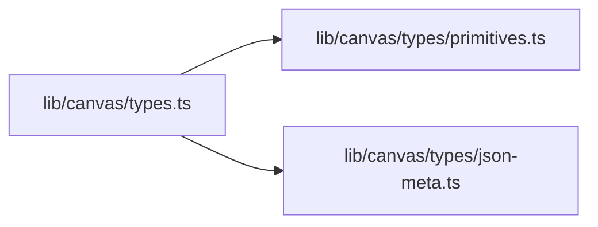
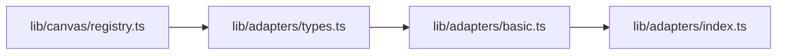
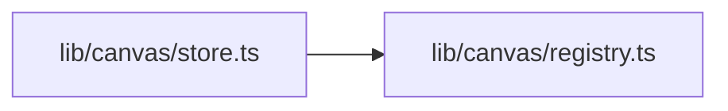
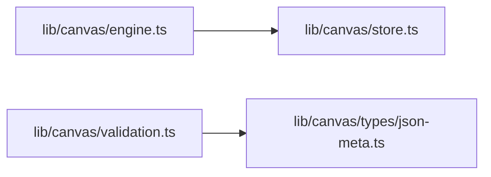
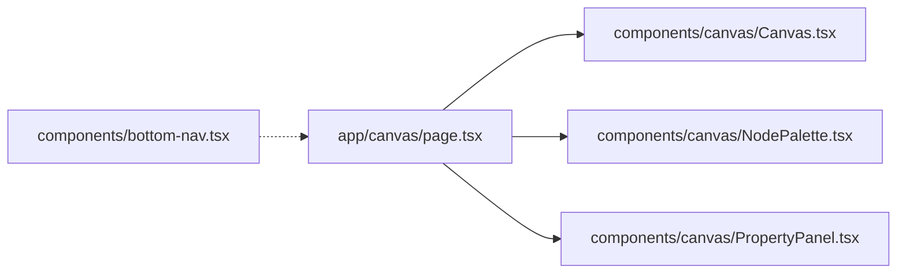
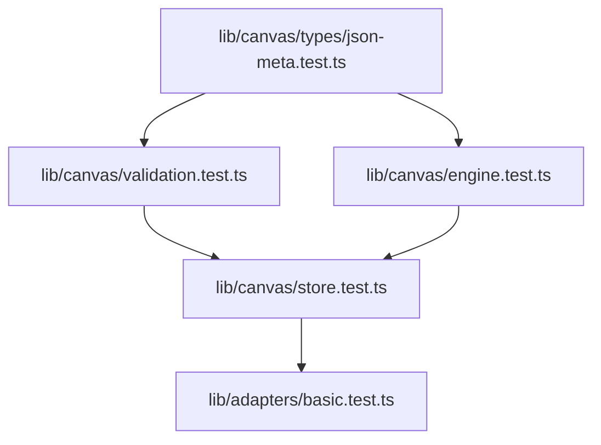

# 低代码画布实现计划

## 1. 依赖安装

```bash
pnpm add @xyflow/react zustand
```

---

## 2. 文件清单

### 2.1 核心类型层

| 文件 | 职责 | 新增/修改 |
|------|------|-----------|
| `lib/canvas/types.ts` | DataType, PortDefinition, NodeDefinition, NodeInstance, Edge | 新增 |
| `lib/canvas/types/primitives.ts` | TYPE_COLORS, TYPE_BG_COLORS | 新增 |
| `lib/canvas/types/json-meta.ts` | JsonMeta, createJsonPort, validateJsonTypename | 新增 |

### 2.2 注册表层

| 文件 | 职责 | 新增/修改 |
|------|------|-----------|
| `lib/canvas/registry.ts` | nodeRegistry Map, registerNode, getNodeDefinition, getAllNodes | 新增 |

### 2.3 适配器层

| 文件 | 职责 | 新增/修改 |
|------|------|-----------|
| `lib/adapters/types.ts` | ToolAdapter 接口定义 | 新增 |
| `lib/adapters/basic.ts` | StringNode, NumberNode, JsonNode, FileNode | 新增 |
| `lib/adapters/hash.ts` | Hash 工具适配 | 新增 |
| `lib/adapters/hmac.ts` | HMAC 工具适配 | 新增 |
| `lib/adapters/crypto.ts` | Crypto 工具适配 | 新增 |
| `lib/adapters/encoding.ts` | Encoding 工具适配 | 新增 |
| `lib/adapters/classic-cipher.ts` | Classic Cipher 工具适配 | 新增 |
| `lib/adapters/jwt.ts` | JWT 工具适配 | 新增 |
| `lib/adapters/json-format.ts` | JSON 格式化工具适配 | 新增 |
| `lib/adapters/protobuf.ts` | Protobuf 工具适配 | 新增 |
| `lib/adapters/jce.ts` | JCE 工具适配 | 新增 |
| `lib/adapters/image-to-base64.ts` | Image to Base64 适配 | 新增 |
| `lib/adapters/exif-viewer.ts` | EXIF Viewer 适配 | 新增 |
| `lib/adapters/image-compress.ts` | Image Compress 适配 | 新增 |
| `lib/adapters/image-editor.ts` | Image Editor 适配 | 新增 |
| `lib/adapters/qrcode.ts` | QRCode Generate 适配 | 新增 |
| `lib/adapters/qrcode-decode.ts` | QRCode Decode 适配 | 新增 |
| `lib/adapters/meme-splitter.ts` | Meme Splitter 适配 | 新增 |
| `lib/adapters/image-coordinates.ts` | Image Coordinates 适配 | 新增 |
| `lib/adapters/text-stats.ts` | Text Stats 适配 | 新增 |
| `lib/adapters/case-converter.ts` | Case Converter 适配 | 新增 |
| `lib/adapters/regex.ts` | Regex 适配 | 新增 |
| `lib/adapters/diff.ts` | Diff 适配 | 新增 |
| `lib/adapters/http-tester.ts` | HTTP Tester 适配 | 新增 |
| `lib/adapters/crontab.ts` | Crontab 适配 | 新增 |
| `lib/adapters/docker-converter.ts` | Docker Converter 适配 | 新增 |
| `lib/adapters/whois.ts` | Whois 适配 | 新增 |
| `lib/adapters/uuid.ts` | UUID 适配 | 新增 |
| `lib/adapters/totp.ts` | TOTP 适配 | 新增 |
| `lib/adapters/color.ts` | Color 适配 | 新增 |
| `lib/adapters/base-converter.ts` | Base Converter 适配 | 新增 |
| `lib/adapters/temperature-converter.ts` | Temperature Converter 适配 | 新增 |
| `lib/adapters/currency.ts` | Currency 适配 | 新增 |
| `lib/adapters/bmi.ts` | BMI 适配 | 新增 |
| `lib/adapters/device-info.ts` | Device Info 适配 | 新增 |
| `lib/adapters/office-viewer.ts` | Office Viewer 适配 | 新增 |
| `lib/adapters/time.ts` | Time 适配 | 新增 |
| `lib/adapters/index.ts` | 批量注册所有适配器 | 新增 |

### 2.4 状态管理层

| 文件 | 职责 | 新增/修改 |
|------|------|-----------|
| `lib/canvas/store.ts` | Zustand store: nodes, edges, nodeOutputs, nodeErrors, nodeRunning, CRUD, execute | 新增 |

### 2.5 执行引擎层

| 文件 | 职责 | 新增/修改 |
|------|------|-----------|
| `lib/canvas/engine.ts` | topologicalSort, propagateOutputs | 新增 |

### 2.6 验证层

| 文件 | 职责 | 新增/修改 |
|------|------|-----------|
| `lib/canvas/validation.ts` | validateConnection, canAcceptInput | 新增 |

### 2.7 UI 组件层

| 文件 | 职责 | 新增/修改 |
|------|------|-----------|
| `components/canvas/Canvas.tsx` | ReactFlow 画布容器，连线验证回调 | 新增 |
| `components/canvas/NodePalette.tsx` | 左侧面板，分类列出可拖拽节点 | 新增 |
| `components/canvas/PropertyPanel.tsx` | 右侧面板，选中节点的配置编辑 | 新增 |
| `components/canvas/nodes/BaseNode.tsx` | 通用节点外壳，渲染 inputs/outputs/error | 新增 |
| `components/canvas/nodes/BasicStringNode.tsx` | String 节点，带可编辑输入框 | 新增 |
| `components/canvas/nodes/BasicNumberNode.tsx` | Number 节点，带数字输入框 | 新增 |
| `components/canvas/nodes/BasicJsonNode.tsx` | JSON 节点，带 JSON 编辑器 + typename 配置 | 新增 |
| `components/canvas/nodes/BasicFileNode.tsx` | File 节点，带文件上传区域 | 新增 |
| `components/canvas/nodes/ToolNode.tsx` | 工具节点壳，从 registry 动态渲染端口 | 新增 |
| `components/canvas/edges/TypeEdge.tsx` | 带类型颜色的连线 | 新增 |
| `components/canvas/dialogs/TypenameWarningDialog.tsx` | JSON typename 不匹配警告对话框 | 新增 |

### 2.8 页面层

| 文件 | 职责 | 新增/修改 |
|------|------|-----------|
| `app/canvas/page.tsx` | 画布页面入口，组合 Canvas + Palette + PropertyPanel | 新增 |
| `app/canvas/layout.tsx` | 画布页面布局 | 新增 |

### 2.9 导航入口

| 文件 | 职责 | 新增/修改 |
|------|------|-----------|
| `components/bottom-nav.tsx` | 添加「画布」导航入口 | 修改 |

### 2.10 测试文件

| 文件 | 职责 | 新增/修改 |
|------|------|-----------|
| `lib/canvas/types/json-meta.test.ts` | JSON typename 验证测试 | 新增 |
| `lib/canvas/validation.test.ts` | 连接验证逻辑测试 | 新增 |
| `lib/canvas/engine.test.ts` | 拓扑排序测试 | 新增 |
| `lib/canvas/store.test.ts` | Zustand store 集成测试 | 新增 |
| `lib/adapters/basic.test.ts` | 基础节点适配器测试 | 新增 |
| `lib/adapters/hash.test.ts` | Hash 适配器测试 | 新增 |
| `lib/adapters/hmac.test.ts` | HMAC 适配器测试 | 新增 |
| `lib/adapters/crypto.test.ts` | Crypto 适配器测试 | 新增 |
| `lib/adapters/encoding.test.ts` | Encoding 适配器测试 | 新增 |
| `lib/adapters/classic-cipher.test.ts` | Classic Cipher 适配器测试 | 新增 |
| `lib/adapters/jwt.test.ts` | JWT 适配器测试 | 新增 |
| `lib/adapters/json-format.test.ts` | JSON 格式化适配器测试 | 新增 |
| `lib/adapters/protobuf.test.ts` | Protobuf 适配器测试 | 新增 |
| `lib/adapters/jce.test.ts` | JCE 适配器测试 | 新增 |
| `lib/adapters/text-stats.test.ts` | Text Stats 适配器测试 | 新增 |
| `lib/adapters/case-converter.test.ts` | Case Converter 适配器测试 | 新增 |
| `lib/adapters/regex.test.ts` | Regex 适配器测试 | 新增 |
| `lib/adapters/uuid.test.ts` | UUID 适配器测试 | 新增 |
| `lib/adapters/totp.test.ts` | TOTP 适配器测试 | 新增 |
| `lib/adapters/color.test.ts` | Color 适配器测试 | 新增 |
| `lib/adapters/base-converter.test.ts` | Base Converter 适配器测试 | 新增 |
| `lib/adapters/temperature-converter.test.ts` | Temperature Converter 适配器测试 | 新增 |
| `lib/adapters/bmi.test.ts` | BMI 适配器测试 | 新增 |
| `components/canvas/nodes/BaseNode.test.tsx` | BaseNode 组件测试 | 新增 |
| `components/canvas/NodePalette.test.tsx` | NodePalette 组件测试 | 新增 |

### 2.11 现有工具测试

| 文件 | 职责 | 新增/修改 |
|------|------|-----------|
| `app/tools/hash/hash.test.ts` | Hash 工具核心逻辑测试 | 新增 |
| `app/tools/crypto/crypto.test.ts` | Crypto 工具核心逻辑测试 | 新增 |
| `app/tools/encoding/encoding.test.ts` | Encoding 工具核心逻辑测试 | 新增 |
| `app/tools/classic-cipher/classic-cipher.test.ts` | Classic Cipher 工具测试 | 新增 |
| `app/tools/hmac/hmac.test.ts` | HMAC 工具测试 | 新增 |
| `app/tools/json/json.test.ts` | JSON 工具测试 | 新增 |
| `app/tools/protobuf/protobuf.test.ts` | Protobuf 工具测试 | 新增 |
| `app/tools/jce/jce.test.ts` | JCE 工具测试 | 新增 |
| `app/tools/text-stats/text-stats.test.ts` | Text Stats 工具测试 | 新增 |
| `app/tools/case-converter/case-converter.test.ts` | Case Converter 工具测试 | 新增 |
| `app/tools/regex/regex.test.ts` | Regex 工具测试 | 新增 |
| `app/tools/base-converter/base-converter.test.ts` | Base Converter 工具测试 | 新增 |
| `app/tools/temperature-converter/temperature-converter.test.ts` | Temperature Converter 工具测试 | 新增 |
| `app/tools/bmi/bmi.test.ts` | BMI 工具测试 | 新增 |
| `app/tools/crontab/crontab.test.ts` | Crontab 工具测试 | 新增 |
| `app/tools/color/color.test.ts` | Color 工具测试 | 新增 |
| `app/tools/uuid/uuid.test.ts` | UUID 工具测试 | 新增 |
| `app/tools/totp/totp.test.ts` | TOTP 工具测试 | 新增 |
| `app/tools/jwt/jwt.test.ts` | JWT 工具测试 | 新增 |

---

## 3. 开发顺序

### Phase 1: 类型基础 (Day 1)



**任务：**
1. 创建 `lib/canvas/types.ts`，定义 DataType, PortDefinition, NodeDefinition, NodeInstance, Edge
2. 创建 `lib/canvas/types/primitives.ts`，定义类型颜色映射
3. 创建 `lib/canvas/types/json-meta.ts`，实现 createJsonPort, validateJsonTypename

### Phase 2: 注册表 + 基础节点 (Day 1-2)



**任务：**
1. 创建 `lib/canvas/registry.ts`，实现 nodeRegistry Map 和 CRUD 方法
2. 创建 `lib/adapters/types.ts`，定义 ToolAdapter 接口
3. 创建 `lib/adapters/basic.ts`，实现 String/Number/JSON/File 四个基础节点
4. 创建 `lib/adapters/index.ts`，批量注册

### Phase 3: 状态管理 (Day 2)



**任务：**
1. 创建 `lib/canvas/store.ts`，实现：
   - nodes/edges CRUD
   - nodeOutputs/nodeErrors/nodeRunning 状态
   - executeNode 方法（调用 adapter.execute）
   - saveToLocalStorage / loadFromLocalStorage

### Phase 4: 执行引擎 + 连接验证 (Day 2-3)



**任务：**
1. 创建 `lib/canvas/engine.ts`，实现 topologicalSort
2. 创建 `lib/canvas/validation.ts`，实现 validateConnection, canAcceptInput

### Phase 5: UI 组件 (Day 3-4)

```mermaid
graph TB
    A["components/canvas/nodes/BaseNode.tsx"] --> B["components/canvas/nodes/BasicStringNode.tsx"]
    A --> C["components/canvas/nodes/BasicNumberNode.tsx"]
    A --> D["components/canvas/nodes/BasicJsonNode.tsx"]
    A --> E["components/canvas/nodes/BasicFileNode.tsx"]
    A --> F["components/canvas/nodes/ToolNode.tsx"]
    G["components/canvas/Canvas.tsx"] --> H["components/canvas/NodePalette.tsx"]
    G --> I["components/canvas/PropertyPanel.tsx"]
    G --> J["components/canvas/edges/TypeEdge.tsx"]
    G --> K["components/canvas/dialogs/TypenameWarningDialog.tsx"]
```



**任务：**
1. 创建 `BaseNode.tsx`，渲染节点外壳、输入输出端口、错误状态
2. 创建 4 个基础节点组件
3. 创建 `ToolNode.tsx`，从 registry 动态渲染端口
4. 创建 `Canvas.tsx`，集成 ReactFlow，配置连线验证
5. 创建 `NodePalette.tsx`，分类列出节点，支持拖拽
6. 创建 `PropertyPanel.tsx`，编辑选中节点配置
7. 创建 `TypeEdge.tsx`，根据类型颜色渲染连线
8. 创建 `TypenameWarningDialog.tsx`

### Phase 6: 页面集成 (Day 4)



**任务：**
1. 创建 `app/canvas/page.tsx`，组合所有组件
2. 创建 `app/canvas/layout.tsx`
3. 修改 `components/bottom-nav.tsx`，添加画布导航入口

### Phase 7: 核心模块测试 (Day 4-5)



**任务：**
1. 创建 `json-meta.test.ts`，测试 validateJsonTypename, createJsonPort
2. 创建 `validation.test.ts`，测试 validateConnection, canAcceptInput
3. 创建 `engine.test.ts`，测试 topologicalSort（无依赖、有依赖、环形依赖）
4. 创建 `store.test.ts`，测试 Zustand store CRUD 和 executeNode
5. 创建 `basic.test.ts`，测试 4 个基础节点适配器

### Phase 8: 工具适配器 (Day 6-11)

按优先级分批实现，每个适配器同步编写测试：

**第一批：编码加密类 (Day 6-7)**
- [x] hash.ts + hash.test.ts
- [ ] hmac.ts + hmac.test.ts
- [ ] crypto.ts + crypto.test.ts
- [x] encoding.ts + encoding.test.ts
- [ ] classic-cipher.ts + classic-cipher.test.ts
- [ ] jwt.ts + jwt.test.ts

**第二批：数据格式类 (Day 7)**
- [ ] json-format.ts + json-format.test.ts
- [ ] protobuf.ts + protobuf.test.ts
- [ ] jce.ts + jce.test.ts

**第三批：图片处理类 (Day 8-9)**
- [ ] image-to-base64.ts
- [ ] exif-viewer.ts
- [ ] image-compress.ts
- [ ] image-editor.ts
- [ ] qrcode.ts
- [ ] qrcode-decode.ts
- [ ] meme-splitter.ts
- [ ] image-coordinates.ts

**第四批：文本处理类 (Day 9)**
- [ ] text-stats.ts + text-stats.test.ts
- [ ] case-converter.ts + case-converter.test.ts
- [ ] regex.ts + regex.test.ts
- [ ] diff.ts

**第五批：开发工具类 (Day 10)**
- [ ] http-tester.ts
- [ ] crontab.ts + crontab.test.ts
- [ ] docker-converter.ts
- [ ] whois.ts

**第六批：实用工具 + 查看器类 (Day 10-11)**
- [x] uuid.ts + uuid.test.ts
- [ ] totp.ts + totp.test.ts
- [ ] color.ts + color.test.ts
- [x] base-converter.ts + base-converter.test.ts
- [x] temperature-converter.ts + temperature-converter.test.ts
- [ ] currency.ts
- [ ] bmi.ts + bmi.test.ts
- [ ] device-info.ts
- [ ] office-viewer.ts
- [ ] time.ts

### Phase 9: 现有工具测试覆盖 (Day 11-13)

对现有工具核心逻辑补充单元测试：

**编码加密类 (Day 11)**
- [ ] app/tools/hash/hash.test.ts
- [ ] app/tools/crypto/crypto.test.ts
- [ ] app/tools/encoding/encoding.test.ts
- [ ] app/tools/classic-cipher/classic-cipher.test.ts
- [ ] app/tools/hmac/hmac.test.ts
- [ ] app/tools/jwt/jwt.test.ts

**数据格式类 (Day 11)**
- [ ] app/tools/json/json.test.ts
- [ ] app/tools/protobuf/protobuf.test.ts
- [ ] app/tools/jce/jce.test.ts

**文本处理类 (Day 12)**
- [ ] app/tools/text-stats/text-stats.test.ts
- [ ] app/tools/case-converter/case-converter.test.ts
- [ ] app/tools/regex/regex.test.ts

**实用工具类 (Day 12)**
- [ ] app/tools/base-converter/base-converter.test.ts
- [ ] app/tools/temperature-converter/temperature-converter.test.ts
- [ ] app/tools/bmi/bmi.test.ts
- [ ] app/tools/crontab/crontab.test.ts
- [ ] app/tools/color/color.test.ts
- [ ] app/tools/uuid/uuid.test.ts
- [ ] app/tools/totp/totp.test.ts

### Phase 10: 持久化 + 体验优化 (Day 13-14)

**任务：**
1. localStorage 持久化画布状态
2. 导入/导出 JSON 功能
3. 移动端适配
4. 节点拖拽性能优化

---

## 4. 适配器编写规范

每个适配器必须：

```typescript
import type { ToolAdapter } from "./types"

export const xxxAdapter: ToolAdapter = {
  type: "xxx",           // 唯一标识，与工具目录名一致
  category: "crypto",    // basic | crypto | image | text | dev | utility | viewer
  label: "工具名",       // 显示名称
  icon: XxxIcon,         // lucide-react 图标

  inputs: [
    { id: "input1", name: "显示名", dataType: "string", required: true },
    { id: "input2", name: "显示名", dataType: "number", defaultValue: 10 },
  ],

  outputs: [
    { id: "output1", name: "结果", dataType: "string" },
    { id: "output2", name: "元数据", dataType: "json", jsonTypename: "XxxMeta" },
  ],

  config: [
    { id: "option1", name: "选项", dataType: "string", defaultValue: "default" },
  ],

  execute: async (inputs, config) => {
    // 调用现有工具逻辑
    const result = await someToolFunction(inputs.input1, config.option1)
    return { output1: result }
  },
}
```

---

## 5. 验收标准

### 功能验收

- [ ] 画布可自由拖拽、缩放、平移
- [ ] 左侧面板可拖拽节点到画布
- [ ] 节点端口可连线，类型不同时阻止连接
- [ ] JSON typename 不匹配时弹出警告对话框
- [ ] 输入端口只能连接一个输出，输出端口可连接多个输入
- [ ] 连接后自动执行下游节点
- [ ] 右侧面板可编辑选中节点配置
- [ ] 画布状态可保存到 localStorage
- [ ] 所有 34 个工具已适配为节点

### 测试验收

- [ ] 核心模块测试覆盖率 > 90%（类型系统、验证、引擎）
- [ ] 工具适配器测试覆盖率 > 80%
- [ ] 现有工具核心逻辑测试覆盖率 > 70%
- [ ] 所有测试通过 `pnpm test`
- [ ] 无 TypeScript 类型错误

### 性能验收

- [ ] 100 个节点时画布渲染 < 100ms
- [ ] 节点执行结果缓存，避免重复计算
- [ ] 连线拖拽流畅，无卡顿
