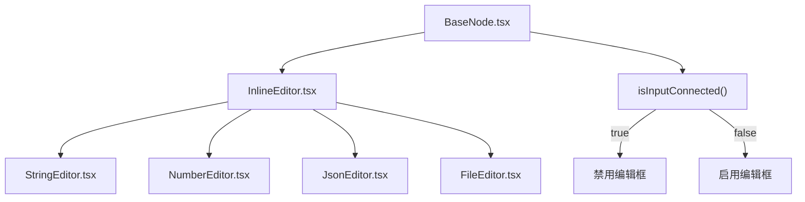

# 低代码画布实现计划

## 0. 需求变更说明

### 核心变更

| 变更项 | 原设计 | 新设计 |
|--------|--------|--------|
| 基础节点编辑 | 仅展示值，编辑在右侧面板 | **节点内嵌编辑框**，可直接编辑 |
| input 连接后 | 无特殊处理 | **禁用编辑框**，只读展示上游值 |
| JSON 节点 | 单行输入 | **多行文本编辑器** |
| File 节点 | 仅上传 | **上传 + 下载按钮** |
| 工具注册 | 部分工具 | **所有 34 个工具必须注册** |

### 新增文件

| 文件 | 职责 |
|------|------|
| `components/canvas/nodes/InlineEditor.tsx` | 内联编辑器容器组件 |
| `components/canvas/nodes/editors/StringEditor.tsx` | String 单行编辑器 |
| `components/canvas/nodes/editors/NumberEditor.tsx` | Number 数字编辑器 |
| `components/canvas/nodes/editors/JsonEditor.tsx` | JSON 多行编辑器 |
| `components/canvas/nodes/editors/FileEditor.tsx` | File 上传+下载编辑器 |

---

## 1. 依赖安装

```bash
pnpm add @xyflow/react zustand
```

---

## 2. 文件清单

### 2.1 核心类型层

| 文件 | 职责 | 新增/修改 |
|------|------|-----------|
| `lib/canvas/types.ts` | DataType, PortDefinition, NodeDefinition, NodeInstance, Edge | 新增 |
| `lib/canvas/types/primitives.ts` | TYPE_COLORS, TYPE_BG_COLORS | 新增 |
| `lib/canvas/types/json-meta.ts` | JsonMeta, createJsonPort, validateJsonTypename | 新增 |

### 2.2 注册表层

| 文件 | 职责 | 新增/修改 |
|------|------|-----------|
| `lib/canvas/registry.ts` | nodeRegistry Map, registerNode, getNodeDefinition, getAllNodes, getNodesByCategory | 新增 |

### 2.3 适配器层

| 文件 | 职责 | 新增/修改 |
|------|------|-----------|
| `lib/adapters/types.ts` | ToolAdapter 接口定义 | 新增 |
| `lib/adapters/basic.ts` | StringNode, NumberNode, JsonNode, FileNode（含输入输出端口） | 新增 |
| `lib/adapters/hash.ts` | Hash 工具适配 | 新增 |
| `lib/adapters/hmac.ts` | HMAC 工具适配 | 新增 |
| `lib/adapters/crypto.ts` | Crypto 工具适配 | 新增 |
| `lib/adapters/encoding.ts` | Encoding 工具适配 | 新增 |
| `lib/adapters/classic-cipher.ts` | Classic Cipher 工具适配 | 新增 |
| `lib/adapters/jwt.ts` | JWT 工具适配 | 新增 |
| `lib/adapters/json-format.ts` | JSON 格式化工具适配 | 新增 |
| `lib/adapters/protobuf.ts` | Protobuf 工具适配 | 新增 |
| `lib/adapters/jce.ts` | JCE 工具适配 | 新增 |
| `lib/adapters/image-to-base64.ts` | Image to Base64 适配 | 新增 |
| `lib/adapters/exif-viewer.ts` | EXIF Viewer 适配 | 新增 |
| `lib/adapters/image-compress.ts` | Image Compress 适配 | 新增 |
| `lib/adapters/image-editor.ts` | Image Editor 适配 | 新增 |
| `lib/adapters/qrcode.ts` | QRCode Generate 适配 | 新增 |
| `lib/adapters/qrcode-decode.ts` | QRCode Decode 适配 | 新增 |
| `lib/adapters/meme-splitter.ts` | Meme Splitter 适配 | 新增 |
| `lib/adapters/image-coordinates.ts` | Image Coordinates 适配 | 新增 |
| `lib/adapters/text-stats.ts` | Text Stats 适配 | 新增 |
| `lib/adapters/case-converter.ts` | Case Converter 适配 | 新增 |
| `lib/adapters/regex.ts` | Regex 适配 | 新增 |
| `lib/adapters/diff.ts` | Diff 适配 | 新增 |
| `lib/adapters/http-tester.ts` | HTTP Tester 适配 | 新增 |
| `lib/adapters/crontab.ts` | Crontab 适配 | 新增 |
| `lib/adapters/docker-converter.ts` | Docker Converter 适配 | 新增 |
| `lib/adapters/whois.ts` | Whois 适配 | 新增 |
| `lib/adapters/uuid.ts` | UUID 适配 | 新增 |
| `lib/adapters/totp.ts` | TOTP 适配 | 新增 |
| `lib/adapters/color.ts` | Color 适配 | 新增 |
| `lib/adapters/base-converter.ts` | Base Converter 适配 | 新增 |
| `lib/adapters/temperature-converter.ts` | Temperature Converter 适配 | 新增 |
| `lib/adapters/currency.ts` | Currency 适配 | 新增 |
| `lib/adapters/bmi.ts` | BMI 适配 | 新增 |
| `lib/adapters/device-info.ts` | Device Info 适配 | 新增 |
| `lib/adapters/office-viewer.ts` | Office Viewer 适配 | 新增 |
| `lib/adapters/time.ts` | Time 适配 | 新增 |
| `lib/adapters/index.ts` | 批量注册所有适配器（34个工具全部注册） | 新增 |

### 2.4 状态管理层

| 文件 | 职责 | 新增/修改 |
|------|------|-----------|
| `lib/canvas/store.ts` | Zustand store: nodes, edges, nodeOutputs, nodeErrors, nodeRunning, CRUD, execute | 新增 |

### 2.5 执行引擎层

| 文件 | 职责 | 新增/修改 |
|------|------|-----------|
| `lib/canvas/engine.ts` | topologicalSort, propagateOutputs | 新增 |

### 2.6 验证层

| 文件 | 职责 | 新增/修改 |
|------|------|-----------|
| `lib/canvas/validation.ts` | validateConnection, canAcceptInput | 新增 |

### 2.7 UI 组件层

| 文件 | 职责 | 新增/修改 |
|------|------|-----------|
| `components/canvas/Canvas.tsx` | ReactFlow 画布容器，连线验证回调，拖拽支持 | 新增 |
| `components/canvas/NodePalette.tsx` | 左侧面板，分类列出可拖拽节点，支持搜索 | 新增 |
| `components/canvas/PropertyPanel.tsx` | 右侧面板，选中节点的配置编辑 | 新增 |
| `components/canvas/nodes/BaseNode.tsx` | 通用节点外壳，渲染 inputs/outputs/error + **内联编辑器** | 新增 |
| `components/canvas/nodes/InlineEditor.tsx` | 内联编辑器容器，根据节点类型分发 | 新增 |
| `components/canvas/nodes/editors/StringEditor.tsx` | String 单行输入框，disabled 状态 | 新增 |
| `components/canvas/nodes/editors/NumberEditor.tsx` | Number 数字输入框，disabled 状态 | 新增 |
| `components/canvas/nodes/editors/JsonEditor.tsx` | JSON 多行 textarea，disabled 状态 | 新增 |
| `components/canvas/nodes/editors/FileEditor.tsx` | File 上传区域 + 下载按钮，disabled 状态 | 新增 |
| `components/canvas/nodes/ToolNode.tsx` | 工具节点壳，从 registry 动态渲染端口 | 新增 |
| `components/canvas/edges/TypeEdge.tsx` | 带类型颜色的连线 | 新增 |
| `components/canvas/dialogs/TypenameWarningDialog.tsx` | JSON typename 不匹配警告对话框 | 新增 |

### 2.8 页面层

| 文件 | 职责 | 新增/修改 |
|------|------|-----------|
| `app/canvas/page.tsx` | 画布页面入口，动态导入 | 新增 |
| `app/canvas/canvas-content.tsx` | 画布内容，组合 Canvas + Palette + PropertyPanel | 新增 |
| `app/canvas/layout.tsx` | 画布页面布局 | 新增 |

### 2.9 导航入口

| 文件 | 职责 | 新增/修改 |
|------|------|-----------|
| `components/bottom-nav.tsx` | 添加「画布」导航入口 | 修改 |

### 2.10 测试文件

| 文件 | 职责 | 新增/修改 |
|------|------|-----------|
| `lib/canvas/types/json-meta.test.ts` | JSON typename 验证测试 | 新增 |
| `lib/canvas/validation.test.ts` | 连接验证逻辑测试 | 新增 |
| `lib/canvas/engine.test.ts` | 拓扑排序测试 | 新增 |
| `lib/canvas/store.test.ts` | Zustand store 集成测试 | 新增 |
| `lib/adapters/basic.test.ts` | 基础节点适配器测试 | 新增 |
| `lib/adapters/hash.test.ts` | Hash 适配器测试 | 新增 |
| `lib/adapters/encoding.test.ts` | Encoding 适配器测试 | 新增 |
| `lib/adapters/uuid.test.ts` | UUID 适配器测试 | 新增 |
| `lib/adapters/base-converter.test.ts` | Base Converter 适配器测试 | 新增 |
| `lib/adapters/temperature-converter.test.ts` | Temperature Converter 适配器测试 | 新增 |
| `e2e/canvas.spec.ts` | Canvas 页面 E2E 测试 | 新增 |

---

## 3. 开发顺序

### Phase 1: 类型基础 + 注册表 (Day 1)

**已完成** ✅

**任务：**
1. ✅ 创建 `lib/canvas/types.ts`
2. ✅ 创建 `lib/canvas/types/primitives.ts`
3. ✅ 创建 `lib/canvas/types/json-meta.ts`
4. ✅ 创建 `lib/canvas/registry.ts`

### Phase 2: 基础节点 - 内联编辑器 (Day 1-2)



**任务：**
1. 重构 `lib/adapters/basic.ts`，为每个基础节点添加 input 端口
2. 创建 `components/canvas/nodes/InlineEditor.tsx` 容器组件
3. 创建 `StringEditor.tsx` - 单行输入框，支持 disabled 状态
4. 创建 `NumberEditor.tsx` - 数字输入框，支持 disabled 状态
5. 创建 `JsonEditor.tsx` - **多行 textarea**，支持 disabled 状态
6. 创建 `FileEditor.tsx` - 上传区域（未连接时）+ **下载按钮**（始终可用）
7. 修改 `BaseNode.tsx`，集成 InlineEditor，检测 input 连接状态

### Phase 3: 状态管理 + 执行引擎 (Day 2)

**已完成** ✅

**任务：**
1. ✅ 创建 `lib/canvas/store.ts`
2. ✅ 创建 `lib/canvas/engine.ts`
3. ✅ 创建 `lib/canvas/validation.ts`

### Phase 4: UI 组件 (Day 2-3)

**已完成** ✅

**任务：**
1. ✅ 创建 `components/canvas/Canvas.tsx`
2. ✅ 创建 `components/canvas/NodePalette.tsx`
3. ✅ 创建 `components/canvas/PropertyPanel.tsx`
4. ✅ 创建 `components/canvas/nodes/BaseNode.tsx`
5. ✅ 创建 `components/canvas/nodes/ToolNode.tsx`

### Phase 5: 页面集成 + 导航 (Day 3)

**已完成** ✅

**任务：**
1. ✅ 创建 `app/canvas/page.tsx`
2. ✅ 创建 `app/canvas/canvas-content.tsx`
3. ✅ 修改 `components/bottom-nav.tsx`

### Phase 6: 工具适配器 - 全量注册 (Day 3-8)

**目标**: 所有 34 个工具必须注册到节点面板

**第一批：编码加密类 (Day 3-4)**
- [x] hash.ts
- [ ] hmac.ts
- [ ] crypto.ts
- [x] encoding.ts
- [ ] classic-cipher.ts
- [ ] jwt.ts

**第二批：数据格式类 (Day 4)**
- [ ] json-format.ts
- [ ] protobuf.ts
- [ ] jce.ts

**第三批：图片处理类 (Day 5-6)**
- [ ] image-to-base64.ts
- [ ] exif-viewer.ts
- [ ] image-compress.ts
- [ ] image-editor.ts
- [ ] qrcode.ts
- [ ] qrcode-decode.ts
- [ ] meme-splitter.ts
- [ ] image-coordinates.ts

**第四批：文本处理类 (Day 6)**
- [ ] text-stats.ts
- [ ] case-converter.ts
- [ ] regex.ts
- [ ] diff.ts

**第五批：开发工具类 (Day 7)**
- [ ] http-tester.ts
- [ ] crontab.ts
- [ ] docker-converter.ts
- [ ] whois.ts

**第六批：实用工具 + 查看器类 (Day 7-8)**
- [x] uuid.ts
- [ ] totp.ts
- [ ] color.ts
- [x] base-converter.ts
- [x] temperature-converter.ts
- [ ] currency.ts
- [ ] bmi.ts
- [ ] device-info.ts
- [ ] office-viewer.ts
- [ ] time.ts

**验收**: `lib/adapters/index.ts` 中 `registerAllAdapters()` 调用所有 34 个注册函数

### Phase 7: 测试 (Day 8-10)

**任务：**
1. 核心模块单元测试（已有）
2. 内联编辑器组件测试
3. 工具适配器测试
4. E2E 测试（已有）

### Phase 8: 持久化 + 体验优化 (Day 10-11)

**任务：**
1. localStorage 持久化画布状态
2. 导入/导出 JSON 功能
3. NodePalette 搜索功能
4. 移动端适配

---

## 4. 适配器编写规范

每个适配器必须：

```typescript
import type { ToolAdapter } from "./types"

export const xxxAdapter: ToolAdapter = {
  type: "xxx",           // 唯一标识，与工具目录名一致
  category: "crypto",    // basic | crypto | image | text | dev | utility | viewer
  label: "工具名",       // 显示名称
  icon: XxxIcon,         // lucide-react 图标

  inputs: [
    { id: "input1", name: "显示名", dataType: "string", required: true },
    { id: "input2", name: "显示名", dataType: "number", defaultValue: 10 },
  ],

  outputs: [
    { id: "output1", name: "结果", dataType: "string" },
    { id: "output2", name: "元数据", dataType: "json", jsonTypename: "XxxMeta" },
  ],

  config: [
    { id: "option1", name: "选项", dataType: "string", defaultValue: "default" },
  ],

  execute: async (inputs, config) => {
    // 调用现有工具逻辑
    const result = await someToolFunction(inputs.input1, config.option1)
    return { output1: result }
  },
}
```

---

## 5. 验收标准

### 功能验收

**画布基础**
- [ ] 画布可自由拖拽、缩放、平移
- [ ] 左侧面板可拖拽节点到画布
- [ ] 节点端口可连线，类型不同时阻止连接
- [ ] JSON typename 不匹配时弹出警告对话框
- [ ] 输入端口只能连接一个输出，输出端口可连接多个输入
- [ ] 连接后自动执行下游节点

**内联编辑**
- [ ] String 节点：节点内显示单行输入框，可直接编辑
- [ ] Number 节点：节点内显示数字输入框，可直接编辑
- [ ] JSON 节点：节点内显示多行 textarea，可直接编辑
- [ ] File 节点：未连接时显示上传区域，已连接时禁用上传
- [ ] File 节点：下载按钮始终可用
- [ ] input 连接后：编辑框自动禁用，只读展示上游值
- [ ] input 断开后：编辑框恢复可编辑状态

**工具注册**
- [ ] 所有 34 个工具已注册到节点面板
- [ ] 节点面板支持按分类浏览
- [ ] 节点面板支持搜索查找

**持久化**
- [ ] 画布状态可保存到 localStorage
- [ ] 支持导出/导入 JSON

### 测试验收

- [ ] 核心模块测试覆盖率 > 90%（类型系统、验证、引擎）
- [ ] 内联编辑器组件测试通过
- [ ] 工具适配器测试覆盖率 > 80%
- [ ] E2E 测试通过（8 个用例）
- [ ] 所有测试通过 `pnpm test`
- [ ] 无 TypeScript 类型错误

### 性能验收

- [ ] 100 个节点时画布渲染 < 100ms
- [ ] 节点执行结果缓存，避免重复计算
- [ ] 连线拖拽流畅，无卡顿
