# Tool Station 产品概览

## 产品定位

Tool Station（工具站）是一款面向开发者和普通用户的**全能在线工具箱**，提供 35+ 种纯客户端运行的实用工具。采用 PWA 架构支持完全离线使用，以 Material You 3 Expressive 设计语言打造统一的视觉体验。

## 核心特性

- **35+ 工具**：覆盖加解密、编码转换、图片处理、格式转换、文本分析、网络调试、时间工具等
- **多标签页界面**：可同时打开多个工具，标签页状态通过 URL 分享
- **纯客户端运行**：所有计算在浏览器中完成（除汇率等需外部 API 的功能）
- **PWA 离线支持**：安装后可离线使用全部工具
- **中英文双语**：完整的中文/英文界面
- **Material You 3 设计**：手搓 M3 Expressive 设计系统，支持动态主题色

## 功能全景图

```mermaid
flowchart TD
    TS[Tool Station] --> SC[安全与加密]
    TS --> ED[编码与数据]
    TS --> IM[图片与媒体]
    TS --> CV[格式转换]
    TS --> TA[文本分析]
    TS --> NW[网络工具]
    TS --> ST[系统与时间]
    TS --> DV[文档查看]

    SC --> H[Hash 计算器]
    SC --> HM[HMAC 计算器]
    SC --> CR[Crypto 加解密]
    SC --> CC[经典密码]
    SC --> JW[JWT 解析]
    SC --> JC[JCE 解析]
    SC --> TP[TOTP 认证器]

    ED --> E2[编码解码]
    ED --> JS[JSON 工具]
    ED --> PB[Protobuf 解析]
    ED --> BC[进制转换]
    ED --> CA[大小写转换]

    IM --> QR[QR 码生成]
    IM --> QD[QR 码解码]
    IM --> IB[图片转 Base64]
    IM --> IC[图片压缩]
    IM --> IE[图片编辑]
    IM --> IX[图片坐标]
    IM --> EX[EXIF 查看]
    IM --> MS[表情包分割]
    IM --> CP[取色器]

    CV --> TC[温度转换]
    CV --> CU[汇率转换]
    CV --> DC[Docker 转换]
    CV --> CR2[Crontab 生成]

    TA --> TS2[文本统计]
    TA --> RG[正则测试]
    TA --> DF[文本对比]

    NW --> WH[WHOIS 查询]
    NW --> HT[HTTP 请求调试]
    NW --> DI[设备信息]

    ST --> TI[时间工具]
    ST --> UG[UUID 生成]
    ST --> BM[BMI 计算]

    DV --> OV[Office 预览]
```

## 相关文档

- [[02-security-crypto]]
- [[03-encoding-data]]
- [[04-image-media]]
- [[05-conversion]]
- [[06-text-analysis]]
- [[07-network-tools]]
- [[08-system-time]]
- [[09-document-tools]]
