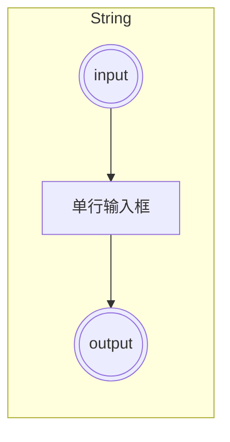
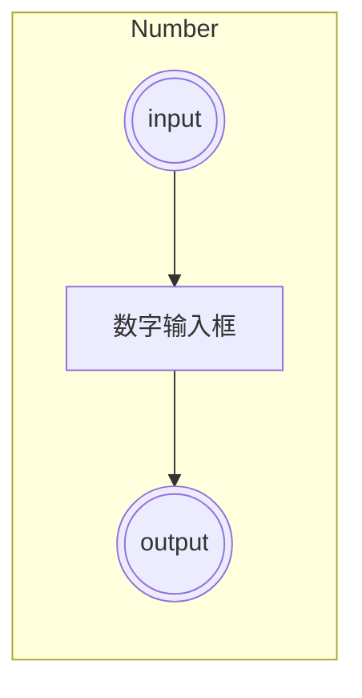
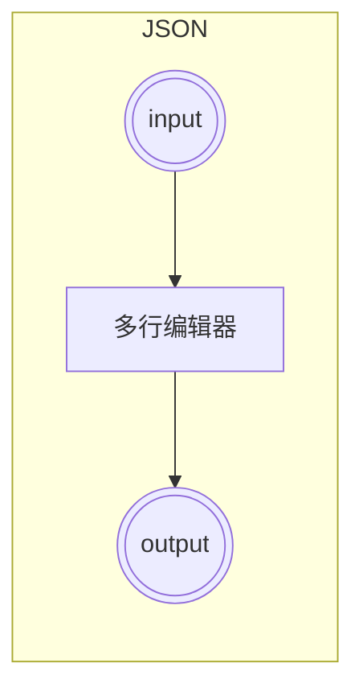
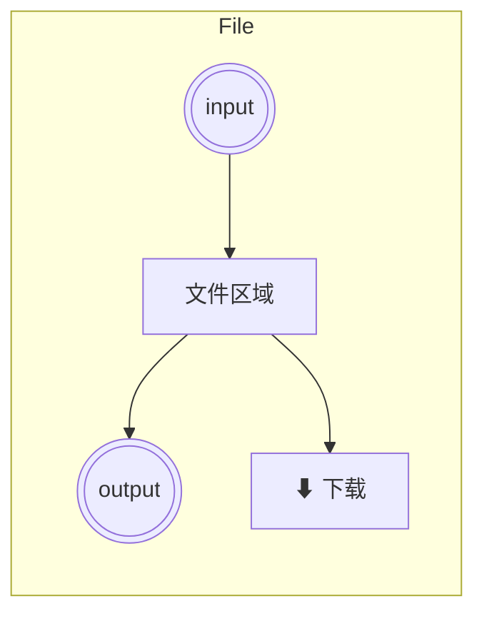

# 低代码节点化工具平台 V2 - 产品方案

## 1. 概述

基于 V1 方案的 PR review 反馈，增强基础节点的交互体验。

### V1 → V2 变更

| 变更项 | V1 | V2 |
|--------|----|----|
| 基础节点编辑 | 仅展示值，编辑在右侧面板 | **节点内嵌编辑框**，可直接编辑 |
| input 连接后 | 无特殊处理 | **禁用编辑框**，只读展示上游值 |
| JSON 节点 | 单行输入 | **多行文本编辑器** |
| File 节点 | 仅上传 | **上传 + 下载按钮** |
| 工具注册 | 5 个工具 | **全部 34 个工具** |

---

## 2. 基础节点设计

### 2.1 String Node



**交互规则**:
- 未连接 input 时：显示可编辑的单行文本输入框
- 已连接 input 时：**禁用输入框**，只读展示上游传入的值
- 输出：当前输入框的值

### 2.2 Number Node



**交互规则**:
- 未连接 input 时：显示可编辑的数字输入框
- 已连接 input 时：**禁用输入框**，只读展示上游传入的值
- 输出：当前输入框的值

### 2.3 JSON Node



**交互规则**:
- 未连接 input 时：显示**多行文本编辑器**（textarea），支持编辑 JSON
- 已连接 input 时：**禁用编辑器**，只读展示上游传入的 JSON
- 输出：当前编辑器的值（解析为 JSON 对象）

### 2.4 File Node



**交互规则**:
- 未连接 input 时：显示**文件上传区域**，支持拖拽上传或点击选择
- 已连接 input 时：**禁用上传**，显示上游传入的文件名和大小
- **下载按钮**：始终可用，点击下载当前文件内容
- 输出：文件二进制数据

---

## 3. 节点内编辑规范

| 节点类型 | 未连接 input | 已连接 input |
|----------|-------------|-------------|
| String | 可编辑单行输入框 | 禁用，只读展示 |
| Number | 可编辑数字输入框 | 禁用，只读展示 |
| JSON | 可编辑多行 textarea | 禁用，只读展示 |
| File | 文件上传区域 | 禁用上传，显示文件名 |

**核心原则**: 
- 编辑框直接内嵌在节点中
- input 连接 = 禁用编辑
- input 断开 = 恢复编辑

---

## 4. 工具注册

### 4.1 注册要求

所有 34 个现有工具必须注册到节点面板，按以下分类组织：

| 分类 | 工具 |
|------|------|
| basic | String, Number, JSON, File |
| crypto | Hash, HMAC, Crypto, Encoding, Classic Cipher, JWT |
| data | JSON Format, Protobuf, JCE |
| image | Image to Base64, EXIF, Compress, Editor, QRCode, Meme Splitter, Coordinates |
| text | Text Stats, Case Converter, Regex, Diff |
| dev | HTTP Tester, Crontab, Docker, Whois |
| utility | UUID, TOTP, Color, Base/Temperature/Currency Converter, BMI |
| viewer | Device Info, Office Viewer, Time |

### 4.2 节点面板

- 左侧侧边栏分类列出所有节点
- 支持搜索功能
- 可拖拽到画布

---

## 5. 数据类型系统

### 基础类型

| 类型 | 标识 | 颜色 | 说明 |
|------|------|------|------|
| String | `string` | 蓝 `#3B82F6` | 文本数据 |
| Number | `number` | 绿 `#10B981` | 数值数据 |
| JSON | `json` | 紫 `#8B5CF6` | 结构化对象，携带 `typename` |
| Bytes | `bytes` | 橙 `#F59E0B` | 二进制数据 |

### JSON 子类型机制

```typescript
interface JsonMeta {
  typename: string  // 例如 "DeviceInfo", "EXIF", "RdapData"
}
```

- 连接时若 `typename` 不匹配，显示警告，用户确认后仍可连接

---

## 6. 连接规则

- 相同数据类型的端口可相互连接
- 一个输入端口只能连接一个输出
- 一个输出端口可连接多个输入
- string ↔ number 兼容连接
- JSON 需检查 typename

---

## 7. 画布交互

| 操作 | 说明 |
|------|------|
| 添加节点 | 侧边栏拖拽 |
| 移动节点 | 鼠标拖拽 |
| 连接端口 | 从输出端口拖拽到输入端口 |
| 删除节点 | 选中后 Delete |
| 画布平移 | 鼠标中键 / 空格+左键 |
| 画布缩放 | 鼠标滚轮 |
