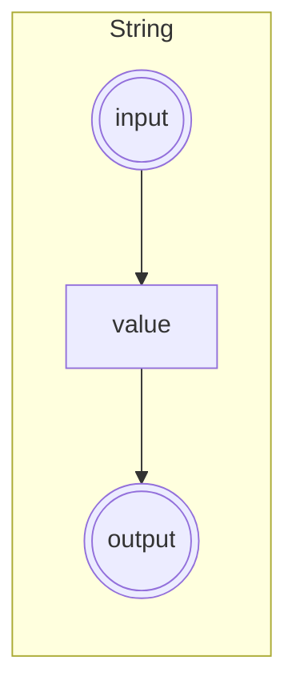
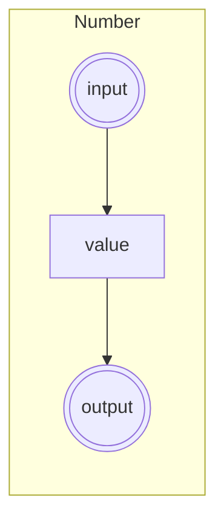
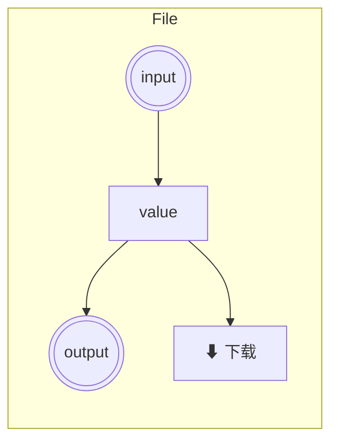
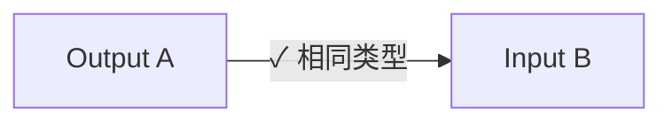
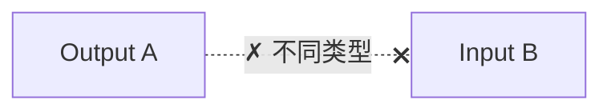
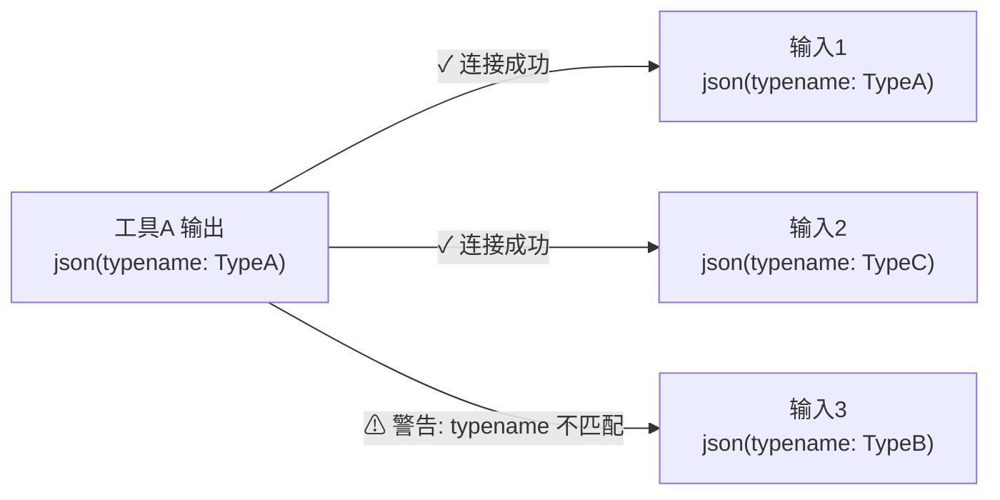

# 低代码节点化工具平台 - 产品方案

## 1. 概述

将现有工具站从独立 Tab 模式改造为低代码拖拽画布，实现工具间的数据串联与编排。

### 核心目标
- 画布式自由拖拽，替代固定 Tab
- 工具封装为 Node，输入输出通过 Port 连接
- 数据类型系统与连接验证
- JSON 子类型元信息机制

---

## 2. 数据类型系统

### 基础类型

| 类型 | 标识 | 颜色 | 说明 |
|------|------|------|------|
| String | `string` | 蓝 `#3B82F6` | 文本数据 |
| Number | `number` | 绿 `#10B981` | 数值数据 |
| JSON | `json` | 紫 `#8B5CF6` | 结构化对象，携带 `typename` 元信息 |
| Bytes | `bytes` | 橙 `#F59E0B` | 二进制数据（Base64/Hex/Uint8Array） |

### JSON 子类型机制

```typescript
interface JsonMeta {
  typename: string  // 例如 "DeviceInfo", "EXIF", "RdapData"
}
```

- JSON 类型输出端口必须携带 `typename` 元信息
- JSON 类型输入端口可声明接受的 `typename`
- 连接时若 `typename` 不匹配，显示警告 Tooltip，用户确认后仍可连接

---

## 3. 基础节点

### 3.1 String Node



- **输入端口**: `input: string` - 接收上游字符串数据
- **输出端口**: `output: string` - 输出当前值
- **节点内展示**: 显示当前值的预览（截断至 50 字符）
- **配置**: 可手动编辑文本，支持单行输入
- **用途**: 手动输入文本、常量、或接收上游数据

### 3.2 Number Node



- **输入端口**: `input: number` - 接收上游数值数据
- **输出端口**: `output: number` - 输出当前值
- **节点内展示**: 显示当前数值
- **配置**: 可手动编辑数字输入框
- **用途**: 手动输入数值、常量、或接收上游数据

### 3.3 JSON Node


- **输入端口**: `input: json` - 接收上游 JSON 数据
- **输出端口**: `output: json(typename)` - 输出 JSON 对象，携带 typename
- **节点内展示**: 显示 JSON 结构预览（折叠展示，可展开）
- **配置**: 多行文本编辑器（支持语法高亮），typename 配置
- **用途**: 手动构造 JSON 常量、接收并转发 JSON 数据

### 3.4 File Node



- **输入端口**: `input: bytes` - 接收上游二进制数据
- **输出端口**: `output: bytes` - 输出文件数据
- **节点内展示**: 
  - 显示文件名和大小
  - **下载按钮**: 点击可将当前内容下载到本地
- **配置**: 文件上传区域，支持拖拽上传
- **用途**: 提供文件数据源、接收并下载文件

---

## 3.5 节点内值展示规范

所有节点必须在节点本身上展示当前值，而不仅仅在右侧属性面板中：

| 节点类型 | 展示内容 | 展示方式 |
|----------|----------|----------|
| String | 文本值预览 | 截断显示，hover 展开 |
| Number | 数值 | 直接显示 |
| JSON | JSON 结构 | 折叠树形预览 |
| File | 文件名 + 大小 | 文本 + 下载按钮 |
| 工具节点 | 输出值预览 | 根据类型截断显示 |

**交互规则**:
- 值为空时显示占位符（灰色斜体）
- 值过长时截断并显示省略号
- 点击节点可选中并在右侧面板编辑完整值

---

## 4. 工具节点建模

### 4.1 建模规则

每个工具节点包含：
- **Inputs**: 工具接受的参数端口
- **Outputs**: 工具产出的结果端口
- **配置项**: 工具内部设置（不影响数据流）
- **节点内展示**: 显示输出值预览

### 4.2 工具注册表

所有现有工具必须注册到节点注册表中，才能在画布中使用。注册信息包括：

```typescript
interface ToolRegistration {
  type: string           // 唯一标识，与工具目录名一致
  category: string       // 分类：crypto | image | text | dev | utility | viewer
  label: string          // 显示名称
  icon: IconComponent    // 图标
  inputs: Port[]         // 输入端口定义
  outputs: Port[]        // 输出端口定义
  config: ConfigField[]  // 配置项定义
  execute: Function      // 执行函数
}
```

### 4.3 工具节点映射表

#### 编码加密类

| 工具 | Inputs | Outputs |
|------|--------|---------|
| **Hash** | `data: string\|bytes`, `algorithm: string` | `hash: string` |
| **HMAC** | `data: string`, `key: string`, `algorithm: string` | `hmac: string` |
| **Crypto** | `data: string\|bytes`, `key: string`, `iv: string`, `algorithm: string`, `mode: string` | `result: string\|bytes` |
| **Encoding** | `input: string`, `encoding: string` | `output: string` |
| **Classic Cipher** | `input: string`, `algorithm: string`, `key: string` | `output: string` |
| **JWT** | `token: string` | `header: json(typename: "JWTHeader")`, `payload: json(typename: "JWTPayload")`, `signature: string` |

#### 数据格式类

| 工具 | Inputs | Outputs |
|------|--------|---------|
| **JSON** | `input: string` | `formatted: string`, `compressed: string`, `yaml: string` |
| **Protobuf** | `data: string\|bytes`, `schema: string` | `decoded: json(typename: "ProtobufMessage")`, `encoded: string\|bytes` |
| **JCE** | `data: string\|bytes` | `decoded: json(typename: "JceData")` |

#### 图片处理类

| 工具 | Inputs | Outputs |
|------|--------|---------|
| **Image to Base64** | `image: bytes` | `base64: string`, `dimensions: json(typename: "ImageDimensions")` |
| **EXIF Viewer** | `image: bytes` | `exif: json(typename: "EXIFData")` |
| **Image Compress** | `image: bytes`, `quality: number` | `compressed: bytes`, `stats: json(typename: "CompressStats")` |
| **Image Editor** | `image: bytes`, `rotation: number`, `brightness: number`, `contrast: number` | `edited: bytes` |
| **QRCode Generate** | `content: string`, `size: number` | `qrcode: bytes` |
| **QRCode Decode** | `image: bytes` | `data: string`, `parsed: json(typename: "QRCodeContent")` |
| **Meme Splitter** | `image: bytes`, `columns: number`, `rows: number` | `images: bytes[]` |
| **Image Coordinates** | `image: bytes`, `x: number`, `y: number` | `coordinates: json(typename: "Coordinates")` |

#### 文本处理类

| 工具 | Inputs | Outputs |
|------|--------|---------|
| **Text Stats** | `text: string` | `stats: json(typename: "TextStatistics")` |
| **Case Converter** | `text: string`, `case: string` | `result: string` |
| **Regex** | `pattern: string`, `text: string` | `matches: json(typename: "RegexMatches")`, `replaced: string` |
| **Diff** | `text1: string`, `text2: string` | `diff: json(typename: "DiffResult")` |

#### 开发工具类

| 工具 | Inputs | Outputs |
|------|--------|---------|
| **HTTP Tester** | `method: string`, `url: string`, `headers: json`, `body: string` | `response: json(typename: "HTTPResponse")` |
| **Crontab** | `expression: string` | `description: string`, `nextRuns: json(typename: "CronSchedule")` |
| **Docker Converter** | `input: string` | `output: string` |
| **Whois** | `domain: string` | `info: json(typename: "WhoisInfo")` |

#### 实用工具类

| 工具 | Inputs | Outputs |
|------|--------|---------|
| **UUID** | _(none)_ | `uuid: string` |
| **TOTP** | `secret: string` | `code: string`, `remaining: number` |
| **Color** | `color: string` | `hex: string`, `rgb: json(typename: "ColorRGB")`, `hsl: json(typename: "ColorHSL")` |
| **Base Converter** | `value: string`, `fromBase: number`, `toBase: number` | `result: string` |
| **Temperature Converter** | `value: number`, `from: string`, `to: string` | `result: number` |
| **Currency** | `amount: number`, `from: string`, `to: string` | `result: number`, `rate: number` |
| **BMI** | `height: number`, `weight: number` | `bmi: number`, `category: string` |

#### 查看器类

| 工具 | Inputs | Outputs |
|------|--------|---------|
| **Device Info** | _(none)_ | `info: json(typename: "DeviceInfo")` |
| **Office Viewer** | `file: bytes` | `preview: json(typename: "OfficeContent")` |
| **Time** | `timestamp: number` | `formatted: string`, `parts: json(typename: "TimeParts")` |

---

## 5. 连接规则

### 5.1 基本规则





- 相同数据类型的端口可相互连接
- 一个输入端口只能连接一个输出
- 一个输出端口可连接多个输入

### 5.2 JSON 子类型验证



连接流程：
1. 拖拽连线到目标端口
2. 检查数据类型是否匹配
3. 若为 JSON 类型，检查 `typename` 是否匹配
4. 不匹配时显示黄色警告 Tooltip：
   - "输出类型 TypeA 与输入类型 TypeB 不匹配，是否继续？"
5. 用户点击「确认」仍可连接，点击「取消」则断开

### 5.3 类型兼容矩阵

| 输出 ↓ \ 输入 → | string | number | json | bytes |
|-----------------|--------|--------|------|-------|
| **string** | ✓ | △(自动转换) | ✗ | ✗ |
| **number** | △(自动转换) | ✓ | ✗ | ✗ |
| **json** | ✗ | ✗ | ✓(检查typename) | ✗ |
| **bytes** | ✗ | ✗ | ✗ | ✓ |

- ✓ = 直接连接
- △ = 兼容连接，自动转换
- ✗ = 不可连接

---

## 6. 画布交互设计

### 6.1 画布操作

| 操作 | 说明 |
|------|------|
| 添加节点 | 右键菜单 / 侧边栏拖拽 |
| 移动节点 | 鼠标拖拽节点标题栏 |
| 连接端口 | 从输出端口拖拽到输入端口 |
| 删除节点 | 选中后 Delete 键 / 右键删除 |
| 删除连线 | 选中连线后 Delete / 右键删除 |
| 画布平移 | 鼠标中键拖拽 / 空格+左键 |
| 画布缩放 | 鼠标滚轮 |
| 框选多节点 | 左键拖拽空白区域 |

### 6.2 节点面板

左侧侧边栏分类列出所有可添加的节点：

#### 基础节点
- String, Number, JSON, File

#### 编码加密
- Hash, HMAC, Crypto, Encoding, Classic Cipher, JWT

#### 数据格式
- JSON Format, Protobuf, JCE

#### 图片处理
- Image to Base64, EXIF Viewer, Image Compress, Image Editor
- QRCode Generate, QRCode Decode, Meme Splitter, Image Coordinates

#### 文本处理
- Text Stats, Case Converter, Regex, Diff

#### 开发工具
- HTTP Tester, Crontab, Docker Converter, Whois

#### 实用工具
- UUID, TOTP, Color, Base Converter, Temperature Converter, Currency, BMI

#### 查看器
- Device Info, Office Viewer, Time

**注意**: 所有已在 `app/tools/` 中实现的工具都必须注册到节点面板中，用户可通过搜索快速查找。

### 6.3 执行机制

- 节点数据变更时自动向下传播（惰性求值）
- 支持手动「运行全部」按钮
- 执行中的节点显示加载动画
- 执行错误的节点显示红色边框 + 错误提示

---

## 7. 存储方案

### 7.1 画布状态

```typescript
interface CanvasState {
  nodes: Node[]
  edges: Edge[]
  viewport: { x: number; y: number; zoom: number }
}

interface Node {
  id: string
  type: string           // 工具ID
  position: { x: number; y: number }
  data: {
    config: Record<string, any>  // 工具配置
    inputs: Record<string, any>  // 输入值缓存
  }
}

interface Edge {
  id: string
  source: string         // 源节点ID
  sourceHandle: string   // 源端口ID
  target: string         // 目标节点ID
  targetHandle: string   // 目标端口ID
}
```

### 7.2 持久化

- 画布状态保存至 `localStorage`
- 支持导出/导入 JSON 文件
- URL 参数可携带简化版画布配置

---

## 8. 技术选型

| 模块 | 方案 |
|------|------|
| 画布引擎 | ReactFlow |
| 状态管理 | Zustand |
| 拖拽 | ReactFlow 内置 + dnd-kit 侧边栏 |
| 样式 | 现有 Tailwind + M3 设计系统 |
| 序列化 | JSON |

---

## 9. 实施计划

### Phase 1: 基础框架
- [ ] 集成 ReactFlow
- [ ] 实现画布基础操作（平移/缩放/节点拖拽）
- [ ] 实现 String/Number/JSON/File 四个基础节点
- [ ] 实现端口连接与类型检查

### Phase 2: 工具接入
- [ ] 实现工具节点通用封装层
- [ ] 逐个工具建模并接入
- [ ] 实现 JSON typename 验证与警告

### Phase 3: 数据流
- [ ] 实现节点间数据传递
- [ ] 实现惰性求值执行引擎
- [ ] 实现错误处理与状态显示

### Phase 4: 持久化与体验
- [ ] localStorage 持久化
- [ ] 导入/导出功能
- [ ] 移动端适配
- [ ] 性能优化
